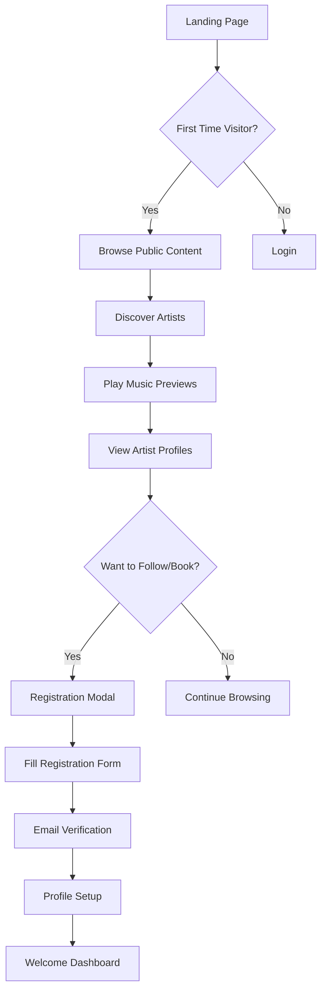
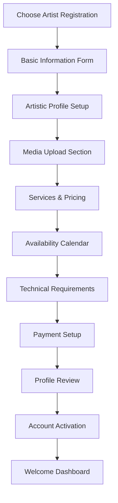
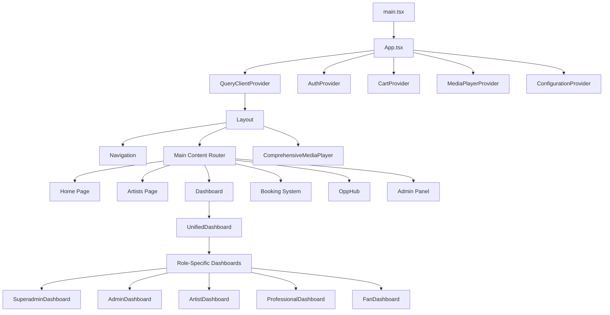
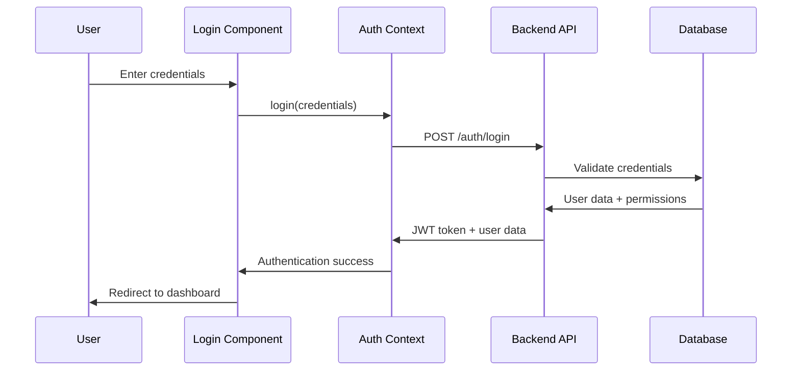
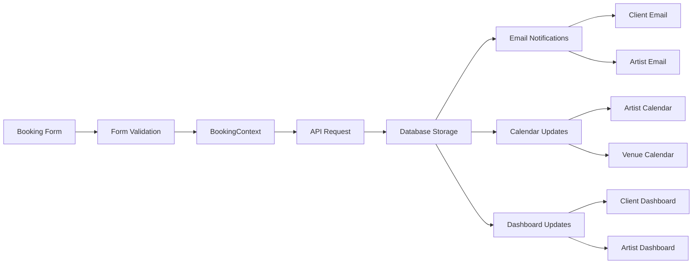
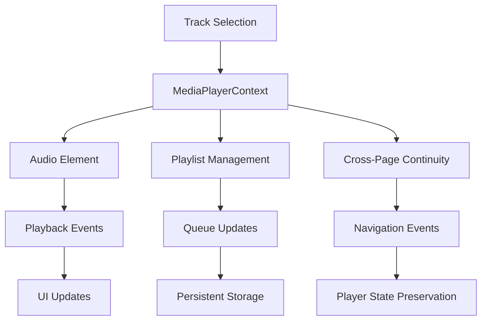

# WaituMusicManager: Complete Platform Documentation

## Table of Contents

1. [Executive Overview](#executive-overview)
2. [Platform Architecture](#platform-architecture)
3. [User Roles & Permissions](#user-roles--permissions)
4. [Visual Design & Color Scheme](#visual-design--color-scheme)
5. [Complete Feature Catalog](#complete-feature-catalog)
6. [Page-by-Page Walkthrough](#page-by-page-walkthrough)
7. [User Workflows by Role](#user-workflows-by-role)
8. [Component Relationships](#component-relationships)
9. [Technical Infrastructure](#technical-infrastructure)
10. [API Endpoints & Database Schema](#api-endpoints--database-schema)
11. [Mobile & PWA Features](#mobile--pwa-features)
12. [Integration Ecosystem](#integration-ecosystem)

---

## Executive Overview

**WaituMusicManager** is a comprehensive, enterprise-grade music industry management platform that serves as a unified ecosystem connecting artists, musicians, professionals, and fans. The platform revolutionizes music industry operations through intelligent automation, sophisticated booking workflows, revenue optimization, and extensive professional services.

### Core Mission
To create the most sophisticated, user-friendly, and feature-complete platform for music industry professionals, enabling seamless management of all aspects of music careers, from creation to monetization.

### Key Statistics
- **70+ unique routes/pages**
- **288 React components**  
- **9 distinct user roles** with granular permissions
- **Full-stack architecture** (React frontend, Node.js/Express backend, PostgreSQL database)
- **50+ specialized modals** for focused workflows
- **Comprehensive responsive design** with PWA capabilities
- **Advanced real-time features** including live media player, notifications, and collaboration tools

---

## Platform Architecture

### Technology Stack

#### Frontend Architecture
- **React 18.3.1** with modern hooks and context
- **TypeScript 5.6.3** for type safety
- **Tailwind CSS 3.4.17** with custom extensions
- **Wouter** for lightweight routing
- **TanStack Query** for server state management
- **Framer Motion** for animations
- **Radix UI** components for accessibility

#### Backend Infrastructure  
- **Node.js** with **Express 4.21.2**
- **TypeScript** throughout the stack
- **Drizzle ORM 0.39.3** for database operations
- **PostgreSQL** primary database
- **JWT authentication** with bcrypt password hashing
- **Multer** for file upload handling
- **Winston** for structured logging

#### Key Dependencies & Integrations
- **Stripe** for payment processing
- **SendGrid** for email services
- **Google Cloud Storage** for media files
- **WebSocket** real-time communication
- **OpenAI API** for intelligent features
- **PDF generation** with PDFKit
- **QR code generation** for tickets
- **Canvas** for image manipulation

### File Structure Overview
```
WaituMusicManager/
├── client/                    # Frontend React application
│   ├── src/
│   │   ├── components/        # 288 React components
│   │   │   ├── admin/         # Admin-specific components
│   │   │   ├── analytics/     # Analytics & reporting
│   │   │   ├── booking/       # Booking system components
│   │   │   ├── dashboard/     # Dashboard widgets
│   │   │   ├── gighub/        # GigHub marketplace
│   │   │   ├── media/         # Music & media players
│   │   │   ├── modals/        # 50+ specialized modals
│   │   │   ├── music/         # Music management
│   │   │   ├── professional/  # Professional services
│   │   │   ├── revenue/       # Revenue analytics
│   │   │   ├── technical-rider/ # Technical requirements
│   │   │   └── ui/           # Reusable UI components
│   │   ├── contexts/         # React context providers
│   │   ├── hooks/            # Custom React hooks
│   │   ├── pages/            # 70+ page components
│   │   └── styles/           # CSS and styling
├── server/                   # Backend Express application
│   ├── routes/              # API route handlers
│   ├── middleware/          # Authentication & security
│   └── services/            # Business logic
├── shared/                  # Shared types & schemas
└── dist/                    # Production build output
```

---

## User Roles & Permissions

The platform implements a sophisticated 9-tier role-based access control system with granular permissions.

### Role Hierarchy & Creative Display Names

| System Role | Creative Display Name | Description | Management Level |
|-------------|----------------------|-------------|------------------|
| `superadmin` | **Platform Maestro** | Full system control, platform oversight | Enterprise |
| `admin` | **Music Director** | Administrative control, user management | Administrative |
| `managed_artist` | **Star Talent** | Professional artist with management | Managed Professional |
| `artist` | **Rising Artist** | Independent artist/performer | Independent |
| `managed_musician` | **Studio Pro** | Professional musician with representation | Managed Professional |
| `musician` | **Session Player** | Independent musician | Independent |
| `managed_professional` | **Industry Expert** | Managed music industry professional | Managed Professional |
| `professional` | **Music Professional** | Independent industry professional | Independent |
| `fan` | **Music Lover** | General platform user | Consumer |

### Detailed Permission Matrix

#### Management Permissions
- **View User Management**: Basic user information access
- **Edit User Management**: Create, edit, manage user accounts
- **Admin User Management**: Full user administration including role changes

#### Booking Permissions
- **View Bookings**: Access booking information
- **View Assigned Bookings**: See bookings assigned to talent
- **Respond to Bookings**: Approve, reject, counter-offer bookings
- **Create Bookings**: Initiate new booking requests
- **Manage Bookings**: Edit and approve existing bookings
- **Admin Bookings**: Full booking administration
- **Technical Riders**: Create and manage technical requirements
- **Assignment Management**: Handle talent assignments

#### Content Permissions
- **View Content**: Access songs, albums, merchandise
- **Upload Content**: Add new songs, albums, media
- **Manage Content**: Edit and organize all content
- **Admin Content**: Full content administration
- **Merchandise Management**: Create and manage products
- **Contract Management**: Handle legal agreements
- **Splitsheet Management**: Manage revenue sharing

#### Analytics & Revenue Permissions
- **View Analytics**: Basic performance metrics
- **Advanced Analytics**: Detailed reports and insights
- **Revenue Analytics**: Financial performance data
- **Admin Analytics**: Full analytics administration

#### Marketing & Opportunity Permissions
- **View Marketing**: Access marketing campaigns
- **Create Campaigns**: Launch promotional activities
- **Newsletter Management**: Email marketing tools
- **Press Release Management**: Media relations
- **OppHub Access**: Opportunity marketplace
- **OppHub Premium**: Advanced opportunity features

#### System Permissions
- **View System Config**: System configuration access
- **Edit System Config**: Modify system settings
- **Admin System Config**: Full system administration
- **Database Access**: Direct database management
- **Security Audit**: Security and compliance features

---

## Visual Design & Color Scheme

### Brand Identity & Color Palette

The platform employs a sophisticated **Purple & Red gradient theme** that represents creativity, passion, and professionalism in the music industry.

#### Primary Color Variables (CSS Custom Properties)
```css
:root {
  /* Core Brand Colors */
  --primary: 262 83% 58%;           /* Rich Purple (#7C3AED) */
  --accent: 0 84% 60%;              /* Vibrant Red (#F87171) */
  --secondary: 220 14.3% 95.9%;     /* Light Gray */
  
  /* Background Colors */
  --background: 0 0% 100%;          /* Pure White */
  --card: 0 0% 100%;               /* Card Background */
  --popover: 0 0% 100%;            /* Modal/Popover Background */
  
  /* Text Colors */
  --foreground: 224 71.4% 4.1%;    /* Dark Navy Text */
  --muted-foreground: 220 8.9% 46.1%; /* Muted Gray Text */
  
  /* Interactive Elements */
  --border: 220 13% 91%;           /* Border Gray */
  --input: 220 13% 91%;            /* Input Border */
  --ring: 262 83% 58%;             /* Focus Ring (Purple) */
  
  /* WaituMusic Signature Gradients */
  --gradient-primary: linear-gradient(135deg, hsl(262, 83%, 58%) 0%, hsl(0, 84%, 60%) 100%);
  --gradient-secondary: linear-gradient(135deg, hsl(0, 84%, 60%) 0%, hsl(262, 83%, 58%) 100%);
  --gradient-accent: linear-gradient(135deg, hsl(262, 83%, 58%) 0%, hsl(0, 84%, 60%) 100%);
}
```

#### Dark Mode Support
```css
.dark {
  --background: 224 71.4% 4.1%;     /* Dark Navy Background */
  --foreground: 210 20% 98%;        /* Light Text */
  --card: 224 71.4% 4.1%;          /* Dark Card */
  --secondary: 215 27.9% 16.9%;     /* Dark Secondary */
  --muted: 215 27.9% 16.9%;        /* Dark Muted */
  --border: 215 27.9% 16.9%;       /* Dark Border */
  --input: 215 27.9% 16.9%;        /* Dark Input */
}
```

### Typography System
- **Primary Font**: Inter (system-ui fallback)
- **Headings**: Various weights (400-800)
- **Body Text**: 400-500 weight range
- **Code/Monospace**: System monospace fonts

### Component-Specific Styling Patterns

#### Card Variants
```css
/* Musical Card with Shimmer Effect */
.card-musical {
  background: linear-gradient(to bottom right, white, rgb(239 246 255));
  border: 1px solid rgb(191 219 254);
  box-shadow: 0 10px 15px -3px rgb(59 130 246 / 0.1);
  transition: all 300ms ease-out;
  position: relative;
  overflow: hidden;
}

.card-musical::before {
  content: '';
  position: absolute;
  top: 0; left: -100%; width: 100%; height: 100%;
  background: linear-gradient(90deg, transparent, rgba(255,255,255,0.2), transparent);
  transition: left 0.5s;
}

.card-musical:hover::before {
  left: 100%;
}

/* Artist Card with Purple Theme */
.card-artist {
  background: linear-gradient(to bottom right, rgb(250 245 255), rgb(252 231 243));
  border: 1px solid rgb(196 181 253);
  box-shadow: 0 10px 15px -3px rgb(147 51 234 / 0.1);
  transform-origin: center;
  transition: all 300ms ease-out;
}

.card-artist:hover {
  transform: translateY(-8px) scale(1.05);
  box-shadow: 0 25px 25px -5px rgb(147 51 234 / 0.25);
}
```

#### Button System
```css
/* Primary Musical Button */
.btn-musical {
  background: linear-gradient(to right, rgb(59 130 246), rgb(147 51 234));
  color: white;
  font-weight: 600;
  box-shadow: 0 10px 15px -3px rgb(59 130 246 / 0.3);
  transition: all 300ms ease-out;
  position: relative;
  overflow: hidden;
}

.btn-musical:hover {
  box-shadow: 0 20px 25px -5px rgb(59 130 246 / 0.4);
  transform: translateY(-2px) scale(1.05);
}

/* Ripple Effect on Click */
.btn-musical::before {
  content: '';
  position: absolute;
  top: 50%; left: 50%;
  width: 0; height: 0;
  background: rgba(255, 255, 255, 0.3);
  border-radius: 50%;
  transform: translate(-50%, -50%);
  transition: width 0.3s, height 0.3s;
}

.btn-musical:hover::before {
  width: 300px; height: 300px;
}
```

### Animation Library

The platform includes an extensive animation system with musical-themed effects:

#### Core Animations
```css
/* Musical Note Animation */
@keyframes musicNote {
  0%, 100% { transform: translateY(0px) rotate(0deg); }
  25% { transform: translateY(-10px) rotate(5deg); }
  50% { transform: translateY(-5px) rotate(-3deg); }
  75% { transform: translateY(-8px) rotate(2deg); }
}

/* Fade In Up Animation */
@keyframes fadeInUp {
  from { opacity: 0; transform: translateY(30px); }
  to { opacity: 1; transform: translateY(0); }
}

/* Piano Key Press Effect */
@keyframes piano-key-press {
  0% { transform: translateY(0px); }
  50% { transform: translateY(2px); }
  100% { transform: translateY(0px); }
}

/* Cart Bounce for Shopping Actions */
@keyframes cartBounce {
  0%, 100% { transform: scale(1) rotate(0deg); }
  25% { transform: scale(1.1) rotate(-3deg); }
  50% { transform: scale(1.2) rotate(3deg); }
  75% { transform: scale(1.1) rotate(-1deg); }
}
```

#### Musical Tab System
The platform features a unique musical tab interface with piano-key inspired interactions:

**Mobile Musical Tabs**:
```css
.musical-tabs-list {
  display: grid;
  grid-template-columns: repeat(5, 1fr);
  background: linear-gradient(135deg, #667eea 0%, #764ba2 100%);
  padding: 0.5rem;
  border-radius: 1rem;
  margin: 0.5rem 0;
}

.musical-tab-trigger {
  display: flex;
  flex-direction: column;
  align-items: center;
  padding: 0.75rem 0.25rem;
  min-height: 60px;
  border-radius: 0.75rem;
  background: rgba(255,255,255,0.1);
  border: 1px solid rgba(255,255,255,0.2);
  color: white;
  transition: all 0.3s ease;
}

.musical-tab-trigger[data-state="active"] {
  background: linear-gradient(135deg, #10b981 0%, #059669 100%);
  box-shadow: 0 4px 15px rgba(16, 185, 129, 0.4);
  transform: translateY(-2px);
}
```

### Responsive Design System

#### Mobile-First Approach
```css
/* Mobile Container System */
.mobile-container {
  width: 100%;
  max-width: 100vw;
  padding-left: 0.75rem;
  padding-right: 0.75rem;
  overflow-x: hidden;
}

/* Touch-Friendly Targets */
@media (max-width: 768px) {
  button, a, input[type="button"], [role="button"] {
    min-height: 44px;
    min-width: 44px;
  }
  
  .mobile-input {
    height: 3rem;
    font-size: 1rem; /* Prevents zoom on iOS */
    padding: 0.75rem;
  }
}
```

#### Progressive Enhancement
```css
/* Desktop Enhancement */
@media (min-width: 769px) {
  .musical-tabs-list {
    grid-template-columns: repeat(5, 1fr);
    background: linear-gradient(135deg, #f8fafc 0%, #e2e8f0 100%);
    border: 1px solid #e2e8f0;
    border-radius: 0.5rem;
  }
  
  .musical-tab-trigger {
    flex-direction: row;
    gap: 0.5rem;
    padding: 0.75rem 1rem;
    color: #64748b;
  }
}
```

---

## Complete Feature Catalog

### Core Platform Features

#### 1. Authentication & User Management
- **Multi-tier registration system** with role selection
- **JWT-based authentication** with secure token handling
- **Password reset & email verification**
- **Social login integration** (Google, Facebook ready)
- **Profile customization** with avatar/cover images
- **Privacy settings** (public/private profiles)
- **Demo mode** for testing without signup

#### 2. Universal Music Player System
**ComprehensiveMediaPlayer** - Persistent across all pages
- **Queue management** with drag-and-drop reordering
- **Shuffle & repeat modes**
- **Volume control** with visual indicators
- **Progress scrubbing** with time display
- **Playlist creation** and management
- **Cross-fade transitions** between tracks
- **Keyboard shortcuts** (spacebar play/pause, arrow keys)
- **Background play** while navigating
- **Now playing** visualization with album art

#### 3. Advanced Booking System
**ComprehensiveBookingWorkflow** - Multi-stage process
- **Booking request creation** with detailed requirements
- **Multi-party approval workflow**
- **Technical rider integration**
- **Hospitality requirements** specification
- **Performance requirements** documentation
- **Contract generation** and e-signature
- **Payment milestone tracking**
- **Calendar integration** with availability checking
- **Mobile-optimized** booking interface
- **Offline booking** capability (PWA)

#### 4. OppHub Marketplace
**Enhanced opportunity discovery platform**
- **Intelligent matching** algorithm
- **Premium listing** features
- **Application tracking** system
- **Success metrics** and analytics
- **Commission calculation** tools
- **Review and rating** system
- **Wishlist and favorites**
- **Real-time notifications**
- **Geographic filtering**
- **Budget range** specifications

#### 5. Technical Rider System
**Professional-grade technical documentation**
- **Stage plot designer** with drag-and-drop elements
- **Equipment specification** forms
- **Power requirements** calculator
- **Mixer patch** configuration (32-port support)
- **Monitor mix** requirements
- **Lighting specifications**
- **Backline requirements**
- **Load-in/load-out** scheduling
- **PDF generation** for venues
- **Version control** and approval workflow

#### 6. Revenue Analytics Suite
**Multi-dimensional financial tracking**
- **Real-time revenue** dashboards
- **Splitsheet management** with automated calculations
- **Royalty tracking** and distribution
- **Performance analytics** (streams, downloads, sales)
- **Expense tracking** with categorization
- **Tax reporting** preparation tools
- **Forecasting models** based on historical data
- **Multi-currency** support
- **Audit trails** for all financial transactions

#### 7. Content Management System
**Comprehensive media handling**
- **Music upload** with metadata extraction
- **Album creation** and artwork management
- **Video upload** and streaming
- **Merchandise catalog** with inventory tracking
- **Digital product** delivery system
- **ISRC code** generation and management
- **Copyright documentation**
- **License management**
- **Distribution tracking** across platforms

#### 8. Professional Services Marketplace
**Connects industry professionals**
- **Service listing** creation and management
- **Booking calendar** integration
- **Consultation scheduling**
- **Knowledge base** creation and sharing
- **Portfolio showcase**
- **Client testimonials** system
- **Service package** creation
- **Pricing optimization** tools
- **Communication hub**
- **Payment processing** integration

### Advanced Features

#### 9. Collaborative Tools
- **Real-time document** editing and sharing
- **Project management** boards
- **File sharing** and version control
- **Team communication** channels
- **Role-based collaboration** permissions
- **Progress tracking** and milestones
- **Deadline management**
- **Notification system** for updates

#### 10. Mobile PWA Capabilities
- **Offline functionality** for core features
- **Push notifications**
- **Home screen installation**
- **Background sync** for uploads
- **Camera integration** for quick uploads
- **Touch-optimized** interfaces
- **Gesture controls**
- **Device feature** integration (GPS, contacts)

#### 11. Analytics & Intelligence
- **User behavior** tracking and analysis
- **Performance optimization** recommendations
- **Market trend** analysis
- **Competitive intelligence**
- **Social media** integration and tracking
- **SEO optimization** tools
- **A/B testing** framework
- **Custom report** generation

#### 12. Integration Ecosystem
- **Streaming platform** connections (Spotify, Apple Music)
- **Social media** cross-posting
- **CRM system** integration
- **Accounting software** synchronization
- **Email marketing** platform connections
- **Calendar application** synchronization
- **Cloud storage** integration
- **Third-party API** support

---

## Page-by-Page Walkthrough

### 1. Home Page (`/`)
**The platform's welcoming gateway**

#### Visual Design
- **Hero Section**: Full-width gradient background (purple to red) with animated musical note particles
- **Navigation Bar**: Glass-morphism effect with logo, main menu, user authentication controls
- **Statistics Bar**: Real-time platform metrics with animated counters
- **Featured Content**: Carousel showcasing top artists, recent releases, trending bookings

#### Content Sections

**Hero Content**:
```typescript
<section className="hero-musical">
  <h1>Music Professional Management Platform</h1>
  <p>Comprehensive artist management, automated booking workflows, 
     contract generation, and revenue optimization for the modern music industry.</p>
  <div className="hero-actions">
    <Button className="btn-musical">Discover Artists</Button>
    <Button variant="secondary">Book Now</Button>
    <Button variant="outline">View Services</Button>
  </div>
</section>
```

**User Role Showcase**:
- **Visual Grid**: 6 role cards with custom icons and descriptions
- **Color-coded**: Each role has unique gradient background
- **Interactive**: Hover effects with scale transformation
- **Responsive**: Mobile stack, desktop grid layout

**Featured Artists Carousel**:
- **Embla Carousel** with automatic rotation
- **Artist Cards**: Photo, name, genre, booking status
- **Call-to-Action**: Direct links to artist pages and booking
- **Managed Artist** highlighting with crown icons

**Popular Services Grid**:
- **Service Categories**: Booking, Production, Marketing, Technical
- **Pricing Display**: From $X pricing with hover details
- **Icons**: Lucide React icons with animations
- **Quick Book**: Modal trigger buttons

**Platform Statistics** (Real-time):
- Active Artists count with trend indicators
- Completed Bookings with success rate
- Revenue Generated with growth percentage
- User Registrations with monthly increase

**Footer Section**:
- **Company Links**: About, Contact, Terms, Privacy
- **Social Media**: Integrated sharing buttons
- **Newsletter Signup**: Email capture with validation
- **Platform Stats**: Updated metrics display

#### User Interactions
1. **Guest User**: Can browse all content, see public artist profiles
2. **Logged In**: Personalized recommendations, booking history
3. **Mobile**: Optimized touch targets, swipe gestures for carousels
4. **Animations**: Staggered entrance effects, musical note animations

### 2. Artist Pages (`/artists`, `/artists/:id`)

#### Artists Directory (`/artists`)
**Comprehensive artist discovery platform**

**Filter System**:
- **Genre Filter**: Multi-select dropdown with all music genres
- **Location Filter**: Geographic radius search
- **Availability**: Calendar-based availability checking
- **Managed Status**: Separate managed vs independent artists
- **Rating Filter**: Minimum star rating selector
- **Price Range**: Slider for booking budget ranges

**Artist Grid Display**:
```typescript
<div className="artist-grid">
  {artists.map(artist => (
    <Card className="card-artist">
      <CardHeader>
        <Avatar src={artist.avatarUrl} size="large" />
        <Badge>{artist.isManaged ? "Managed" : "Independent"}</Badge>
      </CardHeader>
      <CardContent>
        <h3>{artist.fullName}</h3>
        <p>{artist.genres?.join(", ")}</p>
        <div className="rating-display">
          <StarRating value={artist.rating} readonly />
          <span>({artist.reviewCount} reviews)</span>
        </div>
        <div className="pricing">
          From ${artist.minimumBookingFee}
        </div>
      </CardContent>
      <CardFooter>
        <Button>View Profile</Button>
        <Button variant="secondary">Quick Book</Button>
      </CardFooter>
    </Card>
  ))}
</div>
```

**Search Functionality**:
- **Real-time search** with debouncing
- **Auto-suggestions** based on artist names, genres
- **Search history** for logged-in users
- **Advanced filters** with URL parameter persistence

#### Individual Artist Page (`/artists/:id`)
**Comprehensive artist profiles**

**Hero Section**:
- **Cover Image**: Full-width artist cover photo
- **Profile Photo**: Overlaid circular avatar
- **Essential Info**: Name, location, genres, rating
- **Action Buttons**: Book Now, Follow, Share, Message

**Content Tabs System**:
1. **Overview Tab**:
   - Artist biography with rich text formatting
   - Performance statistics (shows played, hours performed)
   - Genres and specializations
   - Equipment owned/preferred
   - Availability calendar preview

2. **Music Tab**:
   - **Discography**: Albums and singles with cover art
   - **Media Player**: Integrated track previews
   - **Playlists**: Curated music collections
   - **Streaming Links**: External platform connections
   - **Download Options**: High-quality file downloads

3. **Videos Tab**:
   - **Performance Videos**: Live show recordings
   - **Promotional Content**: EPKs and interviews
   - **Behind-the-Scenes**: Studio sessions
   - **Video Gallery**: Organized by category
   - **Embedded Players**: YouTube/Vimeo integration

4. **Reviews Tab**:
   - **Client Testimonials**: Verified booking reviews
   - **Rating Breakdown**: By category (performance, professionalism, value)
   - **Review Timeline**: Chronological display
   - **Response System**: Artist replies to reviews
   - **Verification Badges**: Confirmed booking reviews

5. **Booking Tab**:
   - **Booking Form**: Detailed event information capture
   - **Calendar Integration**: Available dates display
   - **Package Options**: Different service levels
   - **Pricing Calculator**: Dynamic cost estimation
   - **Requirements**: Technical rider, hospitality needs

**Social Features**:
- **Follow System**: Fan following with notifications
- **Share Options**: Social media integration
- **Wishlist**: Save favorite artists
- **Recommendations**: Similar artists suggestions

### 3. Booking System (`/booking`, `/bookings/:id`)

#### Main Booking Page (`/booking`)
**Centralized booking management interface**

**Dashboard View** (Role-Dependent):

**For Clients/Fans**:
- **My Booking Requests**: Active, pending, completed
- **Booking History**: Chronological list with status
- **Favorites**: Saved artists and services
- **Quick Book**: Fast booking for repeat clients

**For Artists/Musicians**:
- **Incoming Requests**: Requires response/action
- **My Schedule**: Calendar view of confirmed bookings
- **Availability Management**: Set available dates/times
- **Performance History**: Past booking records

**For Professionals**:
- **Service Bookings**: Consultation and service requests
- **Client Management**: Relationship tracking
- **Schedule Optimization**: Automated scheduling suggestions
- **Revenue Tracking**: Earnings from bookings

**Advanced Features**:
- **Multi-Event Booking**: Package multiple performances
- **Team Booking**: Coordinate band/crew bookings
- **Recurring Events**: Set up regular performances
- **Template System**: Save common booking configurations

#### Individual Booking Page (`/bookings/:id`)
**Detailed booking workflow management**

**Booking Header**:
- **Status Badge**: Color-coded current status
- **Event Details**: Date, time, venue, duration
- **Participants**: Client, artist, venue, crew
- **Financial Summary**: Total cost, payment status

**Timeline View**:
```typescript
<BookingTimeline>
  <TimelineItem status="completed">
    <TimelineMarker />
    <TimelineContent>
      <h4>Booking Request Submitted</h4>
      <p>Initial request with event details</p>
      <Timestamp>{booking.createdAt}</Timestamp>
    </TimelineContent>
  </TimelineItem>
  
  <TimelineItem status="in-progress">
    <TimelineMarker />
    <TimelineContent>
      <h4>Technical Rider Review</h4>
      <p>Venue reviewing technical requirements</p>
      <ActionButtons>
        <Button>View Rider</Button>
        <Button>Request Changes</Button>
      </ActionButtons>
    </TimelineContent>
  </TimelineItem>
  
  <TimelineItem status="pending">
    <TimelineMarker />
    <TimelineContent>
      <h4>Contract Approval</h4>
      <p>Awaiting final contract signatures</p>
      <PendingIndicator />
    </TimelineContent>
  </TimelineItem>
</BookingTimeline>
```

**Multi-Stage Workflow**:

1. **Initial Request** (Client submits):
   - Event details (date, time, venue, type)
   - Budget range and payment terms
   - Special requirements or requests
   - Contact information and preferences

2. **Artist Response** (24-48 hours):
   - Accept, decline, or counter-offer
   - Technical rider submission
   - Hospitality requirements
   - Performance requirements documentation

3. **Technical Coordination**:
   - Venue technical review
   - Equipment sourcing and setup
   - Sound check scheduling
   - Load-in/load-out planning

4. **Contract Generation**:
   - Automated contract creation
   - Custom terms and conditions
   - Electronic signature workflow
   - Legal compliance checking

5. **Payment Processing**:
   - Deposit collection
   - Milestone payments
   - Final payment processing
   - Invoice generation and delivery

6. **Event Execution**:
   - Day-of coordination
   - Real-time communication
   - Performance tracking
   - Issue resolution

7. **Post-Event Follow-up**:
   - Performance review collection
   - Final payment processing
   - Photo/video sharing
   - Future booking opportunities

**Communication Center**:
- **Message Thread**: All booking-related communication
- **File Sharing**: Contracts, riders, media files
- **Video Calls**: Integrated meeting system
- **Notification System**: Real-time updates for all parties

### 4. Services Marketplace (`/services`)

#### Service Categories
**Professional music industry services**

1. **Production Services**:
   - Recording studio sessions
   - Mixing and mastering
   - Music production consultation
   - Songwriting collaboration
   - Arrangement services

2. **Performance Services**:
   - Session musician hire
   - Backup vocalist services
   - Sound engineering
   - Lighting design
   - Stage management

3. **Business Services**:
   - Music marketing consultation
   - Social media management
   - Brand development
   - PR and publicity
   - Legal consultation

4. **Technical Services**:
   - Equipment rental
   - Technical setup and operation
   - Recording services
   - Live streaming production
   - Audio/video editing

**Service Listing Interface**:
```typescript
<ServiceCard className="card-musical">
  <ServiceHeader>
    <ServiceIcon>{getServiceIcon(service.category)}</ServiceIcon>
    <ServiceBadge type={service.type} />
  </ServiceHeader>
  
  <ServiceContent>
    <h3>{service.name}</h3>
    <p>{service.shortDescription}</p>
    
    <ServiceProvider>
      <Avatar src={service.provider.avatar} size="sm" />
      <span>{service.provider.name}</span>
      <Rating value={service.provider.rating} />
    </ServiceProvider>
    
    <ServicePricing>
      <PriceRange>
        ${service.priceRange.min} - ${service.priceRange.max}
      </PriceRange>
      <Duration>{service.estimatedDuration}</Duration>
    </ServicePricing>
  </ServiceContent>
  
  <ServiceActions>
    <Button variant="primary">Book Service</Button>
    <Button variant="outline">View Details</Button>
    <FavoriteButton serviceId={service.id} />
  </ServiceActions>
</ServiceCard>
```

**Advanced Filtering**:
- **Service Type**: Filter by category and subcategory
- **Provider Rating**: Minimum star rating filter
- **Price Range**: Sliding scale selector
- **Availability**: Date/time availability
- **Location**: Geographic proximity
- **Experience Level**: Years in industry
- **Portfolio**: Sample work availability

### 5. OppHub Marketplace (`/opphub`)

#### Enhanced OppHub Interface
**Intelligent opportunity discovery platform**

**Main Dashboard**:
```typescript
<OppHubDashboard>
  <SearchBar>
    <SearchInput placeholder="Search opportunities..." />
    <FilterButton>
      <Filters>
        <GenreFilter />
        <LocationFilter />
        <BudgetFilter />
        <TypeFilter />
        <DeadlineFilter />
      </Filters>
    </FilterButton>
  </SearchBar>
  
  <OpportunityGrid>
    {opportunities.map(opp => (
      <OpportunityCard key={opp.id}>
        <OpportunityHeader>
          <OpportunityType badge={opp.type} />
          <OpportunityDeadline date={opp.deadline} />
        </OpportunityHeader>
        
        <OpportunityContent>
          <h3>{opp.title}</h3>
          <p>{opp.description}</p>
          
          <OpportunityDetails>
            <Location>{opp.location}</Location>
            <Budget>{opp.budgetRange}</Budget>
            <Timeline>{opp.timeline}</Timeline>
          </OpportunityDetails>
          
          <OpportunityTags>
            {opp.requiredSkills.map(skill => (
              <Badge key={skill}>{skill}</Badge>
            ))}
          </OpportunityTags>
        </OpportunityContent>
        
        <OpportunityActions>
          <Button variant="primary">Apply Now</Button>
          <Button variant="outline">Save</Button>
          <ShareButton opportunityId={opp.id} />
        </OpportunityActions>
      </OpportunityCard>
    ))}
  </OpportunityGrid>
</OppHubDashboard>
```

**Opportunity Types**:

1. **Performance Opportunities**:
   - Festival performances
   - Venue bookings
   - Private events
   - Session work
   - Tour opportunities

2. **Collaboration Projects**:
   - Songwriting partnerships
   - Recording projects
   - Music video features
   - Remix opportunities
   - Featured artist spots

3. **Professional Services**:
   - Marketing campaigns
   - Brand partnerships
   - Endorsement deals
   - Consultation projects
   - Educational opportunities

4. **Competition Entries**:
   - Music competitions
   - Talent shows
   - Showcase opportunities
   - Award submissions
   - Grant applications

**Intelligent Matching Algorithm**:
- **Skill Matching**: Algorithm matches user skills with requirements
- **Location Proximity**: Geographic relevance scoring
- **Budget Alignment**: Financial compatibility assessment
- **Schedule Compatibility**: Availability matching
- **Experience Level**: Appropriate opportunity complexity
- **Genre Preferences**: Musical style alignment
- **Success Rate**: Historical success probability

**Application Management**:
- **Application Tracking**: Status monitoring for all applications
- **Template System**: Reusable application components
- **Portfolio Integration**: Automatic portfolio attachment
- **Follow-up Reminders**: Automated communication scheduling
- **Success Analytics**: Application performance metrics

### 6. Dashboard System (`/dashboard`)

#### Unified Dashboard Architecture
**Role-based personalized control center**

**Common Dashboard Elements** (All Roles):

```typescript
<UnifiedDashboard>
  <DashboardHeader>
    <WelcomeSection>
      <h1>Welcome back, {user.fullName}</h1>
      <RoleDisplay role={user.role} />
    </WelcomeSection>
    
    <QuickActions>
      <QuickActionButton icon={<Music />} label="Upload Music" />
      <QuickActionButton icon={<Calendar />} label="Schedule" />
      <QuickActionButton icon={<DollarSign />} label="Revenue" />
      <QuickActionButton icon={<Users />} label="Connections" />
    </QuickActions>
  </DashboardHeader>
  
  <DashboardStats>
    <StatCard title="This Month" value={stats.monthlyRevenue} icon={<TrendingUp />} />
    <StatCard title="Active Bookings" value={stats.activeBookings} icon={<Calendar />} />
    <StatCard title="Profile Views" value={stats.profileViews} icon={<Eye />} />
    <StatCard title="Completion Rate" value={stats.completionRate} icon={<Check />} />
  </DashboardStats>
  
  <DashboardTabs>
    <Tab label="Overview" />
    <Tab label="Bookings" />
    <Tab label="Analytics" />
    <Tab label="Content" />
    <Tab label="Settings" />
  </DashboardTabs>
</UnifiedDashboard>
```

#### Role-Specific Dashboard Views

**Fan Dashboard**:
- **Following Feed**: Updates from followed artists
- **Ticket Collection**: Purchased and upcoming events
- **Music Library**: Saved songs and playlists
- **Recommendation Engine**: Suggested artists and events
- **Social Activity**: Friend connections and shared music

**Artist/Musician Dashboard**:
- **Performance Calendar**: Upcoming shows and availability
- **Music Analytics**: Streaming stats, download counts
- **Booking Pipeline**: Active booking requests and confirmations
- **Revenue Tracking**: Earnings breakdown by source
- **Fan Engagement**: Follower growth, message center

**Professional Dashboard**:
- **Service Bookings**: Client appointments and consultations
- **Project Portfolio**: Active and completed projects
- **Client Relationship Management**: Contact database
- **Knowledge Base**: Personal resources and documentation
- **Industry Insights**: Market trends and opportunities

**Admin Dashboard**:
- **Platform Analytics**: User growth, engagement metrics
- **User Management**: Account administration tools
- **Content Moderation**: Review and approval workflows
- **System Health**: Performance monitoring and alerts
- **Financial Overview**: Platform revenue and transactions

### 7. Revenue & Analytics (`/revenue`)

#### Comprehensive Revenue Dashboard
**Multi-dimensional financial tracking and analytics**

**Overview Section**:
```typescript
<RevenueOverview>
  <RevenueSummary>
    <TotalRevenue value={analytics.totalRevenue} period="all-time" />
    <MonthlyRevenue value={analytics.monthlyRevenue} growth={analytics.monthlyGrowth} />
    <PendingPayments value={analytics.pendingPayments} />
    <NextPayment date={analytics.nextPaymentDate} amount={analytics.nextAmount} />
  </RevenueSummary>
  
  <RevenueChart>
    <LineChart data={analytics.revenueHistory} />
    <TimeframeSelector options={["7d", "30d", "90d", "1y", "all"]} />
  </RevenueChart>
</RevenueOverview>
```

**Revenue Streams Breakdown**:

1. **Performance Revenue**:
   - Live show earnings
   - Streaming royalties
   - Digital sales
   - Merchandise sales

2. **Service Revenue** (Professionals):
   - Consultation fees
   - Production services
   - Technical services
   - Educational content

3. **Booking Commissions** (Platform):
   - Transaction fees
   - Premium feature subscriptions
   - Advertisement revenue
   - Partnership earnings

**Splitsheet Management**:
```typescript
<SplitsheetManager>
  <SplitsheetList>
    {splitsheets.map(sheet => (
      <SplitsheetCard key={sheet.id}>
        <SplitsheetHeader>
          <h3>{sheet.songTitle}</h3>
          <SplitsheetStatus status={sheet.status} />
        </SplitsheetHeader>
        
        <ParticipantList>
          {sheet.participants.map(participant => (
            <Participant key={participant.id}>
              <Avatar src={participant.avatar} />
              <span>{participant.name}</span>
              <Percentage>{participant.percentage}%</Percentage>
              <Role>{participant.role}</Role>
            </Participant>
          ))}
        </ParticipantList>
        
        <RevenueBreakdown>
          <TotalEarnings value={sheet.totalEarnings} />
          <LastPayment date={sheet.lastPaymentDate} />
          <NextPayment date={sheet.nextPaymentDate} />
        </RevenueBreakdown>
      </SplitsheetCard>
    ))}
  </SplitsheetList>
</SplitsheetManager>
```

**Tax Reporting Tools**:
- **1099 Preparation**: Automated tax document generation
- **Expense Tracking**: Business expense categorization
- **Quarterly Reports**: Regular tax reporting assistance
- **Receipt Management**: Digital receipt storage and organization
- **Tax Deduction Optimization**: Automated deduction identification

### 8. Technical Rider System (`/technical-rider`)

#### Stage Plot Designer
**Professional technical documentation system**

```typescript
<StageplotDesigner>
  <DesignerCanvas>
    <StageArea width={800} height={400}>
      <DraggableElement type="microphone" position={{x: 100, y: 200}} />
      <DraggableElement type="piano" position={{x: 200, y: 150}} />
      <DraggableElement type="drumkit" position={{x: 300, y: 180}} />
      <DraggableElement type="guitar-amp" position={{x: 150, y: 250}} />
      <DraggableElement type="monitor" position={{x: 120, y: 180}} />
    </StageArea>
    
    <GridOverlay show={showGrid} />
    <MeasurementTools enabled={measurementMode} />
  </DesignerCanvas>
  
  <ElementPalette>
    <PaletteSection title="Audio">
      <DraggableItem type="microphone" icon={<Mic />} />
      <DraggableItem type="wireless-mic" icon={<Radio />} />
      <DraggableItem type="monitor" icon={<Speaker />} />
      <DraggableItem type="subwoofer" icon={<Woofer />} />
    </PaletteSection>
    
    <PaletteSection title="Instruments">
      <DraggableItem type="piano" icon={<Piano />} />
      <DraggableItem type="drumkit" icon={<Drums />} />
      <DraggableItem type="guitar-amp" icon={<Amp />} />
      <DraggableItem type="bass-amp" icon={<BassAmp />} />
    </PaletteSection>
    
    <PaletteSection title="Lighting">
      <DraggableItem type="spot-light" icon={<Light />} />
      <DraggableItem type="par-can" icon={<ParCan />} />
      <DraggableItem type="led-strip" icon={<LEDStrip />} />
      <DraggableItem type="moving-head" icon={<MovingHead />} />
    </PaletteSection>
  </ElementPalette>
</StageplotDesigner>
```

**Enhanced Mixer Patch System** (32-Port Support):
```typescript
<MixerPatchSystem>
  <PatchBay channels={32}>
    {Array.from({length: 32}, (_, i) => (
      <ChannelStrip key={i} channel={i + 1}>
        <ChannelInput>
          <InputSource 
            value={patchConfig[i]?.source} 
            onChange={(source) => updatePatch(i, source)}
          />
          <InputGain 
            value={patchConfig[i]?.gain} 
            onChange={(gain) => updatePatch(i, {gain})}
          />
        </ChannelInput>
        
        <ChannelEQ>
          <EQBand frequency="high" value={patchConfig[i]?.eq?.high} />
          <EQBand frequency="mid" value={patchConfig[i]?.eq?.mid} />
          <EQBand frequency="low" value={patchConfig[i]?.eq?.low} />
        </ChannelEQ>
        
        <ChannelSends>
          <MonitorSend value={patchConfig[i]?.monitor} />
          <FXSend value={patchConfig[i]?.fx} />
        </ChannelSends>
        
        <ChannelFader 
          value={patchConfig[i]?.level}
          onChange={(level) => updatePatch(i, {level})}
        />
      </ChannelStrip>
    ))}
  </PatchBay>
  
  <PatchLibrary>
    <PresetButton onClick={() => loadPreset('rock-band')}>
      Rock Band Setup
    </PresetButton>
    <PresetButton onClick={() => loadPreset('acoustic')}>
      Acoustic Performance
    </PresetButton>
    <PresetButton onClick={() => loadPreset('dj-setup')}>
      DJ Configuration
    </PresetButton>
  </PatchLibrary>
</MixerPatchSystem>
```

**Technical Requirements Forms**:

1. **Audio Requirements**:
   - PA system specifications
   - Monitor requirements
   - Microphone needs
   - Direct input requirements
   - Wireless system needs

2. **Lighting Requirements**:
   - Basic lighting needs
   - Special effects requirements
   - Color preferences
   - Dimming requirements
   - Control system needs

3. **Power Requirements**:
   - Total power consumption
   - Outlet requirements
   - Generator needs
   - Distribution requirements
   - Safety considerations

4. **Backline Requirements**:
   - Drum kit specifications
   - Amplifier needs
   - Keyboard requirements
   - Instrument specific needs
   - Brand preferences

### 9. Admin Panel (`/admin`)

#### Comprehensive Administration System
**Platform management and oversight**

**User Management Interface**:
```typescript
<UserManagementPanel>
  <UserSearch>
    <SearchInput placeholder="Search users..." />
    <FilterDropdown>
      <FilterOption value="role">Filter by Role</FilterOption>
      <FilterOption value="status">Filter by Status</FilterOption>
      <FilterOption value="registration">Registration Date</FilterOption>
      <FilterOption value="activity">Last Activity</FilterOption>
    </FilterDropdown>
  </UserSearch>
  
  <UserTable>
    <TableHeader>
      <TableColumn sortable>Name</TableColumn>
      <TableColumn sortable>Email</TableColumn>
      <TableColumn sortable>Role</TableColumn>
      <TableColumn sortable>Status</TableColumn>
      <TableColumn sortable>Registration Date</TableColumn>
      <TableColumn>Actions</TableColumn>
    </TableHeader>
    
    <TableBody>
      {users.map(user => (
        <TableRow key={user.id}>
          <TableCell>
            <UserInfo>
              <Avatar src={user.avatarUrl} size="sm" />
              <span>{user.fullName}</span>
            </UserInfo>
          </TableCell>
          <TableCell>{user.email}</TableCell>
          <TableCell>
            <RoleBadge role={user.role} />
          </TableCell>
          <TableCell>
            <StatusBadge status={user.status} />
          </TableCell>
          <TableCell>
            <DateDisplay date={user.createdAt} />
          </TableCell>
          <TableCell>
            <ActionButtons>
              <Button size="sm" onClick={() => editUser(user.id)}>
                Edit
              </Button>
              <Button size="sm" variant="outline" onClick={() => viewUser(user.id)}>
                View
              </Button>
              <DropdownMenu>
                <DropdownMenuTrigger>
                  <MoreActions />
                </DropdownMenuTrigger>
                <DropdownMenuContent>
                  <DropdownMenuItem onClick={() => resetPassword(user.id)}>
                    Reset Password
                  </DropdownMenuItem>
                  <DropdownMenuItem onClick={() => suspendUser(user.id)}>
                    Suspend Account
                  </DropdownMenuItem>
                  <DropdownMenuItem onClick={() => deleteUser(user.id)}>
                    Delete Account
                  </DropdownMenuItem>
                </DropdownMenuContent>
              </DropdownMenu>
            </ActionButtons>
          </TableCell>
        </TableRow>
      ))}
    </TableBody>
  </UserTable>
</UserManagementPanel>
```

**Platform Analytics Dashboard**:
- **User Growth**: Registration trends and demographic analysis
- **Engagement Metrics**: User activity and retention rates
- **Financial Analytics**: Revenue streams and payment processing
- **Performance Monitoring**: System health and response times
- **Content Analytics**: Upload trends and popular content

**System Configuration**:
- **Feature Flags**: Enable/disable platform features
- **Payment Settings**: Payment processor configuration
- **Email Templates**: Customize automated communications
- **Security Settings**: Authentication and authorization rules
- **Integration Management**: Third-party API configurations

### 10. Store & Merchandise (`/store`)

#### E-commerce Integration
**Digital and physical product marketplace**

**Product Categories**:

1. **Digital Music**:
   - Individual tracks
   - Full albums
   - Exclusive releases
   - High-quality formats (FLAC, WAV)
   - Behind-the-scenes content

2. **Physical Merchandise**:
   - Apparel (t-shirts, hoodies, hats)
   - Accessories (buttons, stickers, posters)
   - Collectibles (signed items, limited editions)
   - Instruments and equipment

3. **Services**:
   - Private lessons
   - Consultation sessions
   - Custom music production
   - Personal performances

4. **Experiences**:
   - Meet and greet packages
   - Studio visit experiences
   - Exclusive concert access
   - Masterclass sessions

**Product Display System**:
```typescript
<ProductGrid>
  {products.map(product => (
    <ProductCard key={product.id}>
      <ProductImage>
        <Image src={product.imageUrl} alt={product.name} />
        <ProductBadges>
          {product.isNew && <Badge>New</Badge>}
          {product.isLimited && <Badge variant="warning">Limited</Badge>}
          {product.isOnSale && <Badge variant="success">Sale</Badge>}
        </ProductBadges>
      </ProductImage>
      
      <ProductInfo>
        <ProductTitle>{product.name}</ProductTitle>
        <ProductArtist>{product.artist}</ProductArtist>
        <ProductDescription>{product.shortDescription}</ProductDescription>
        
        <ProductPricing>
          {product.salePrice ? (
            <>
              <PriceOriginal>${product.originalPrice}</PriceOriginal>
              <PriceSale>${product.salePrice}</PriceSale>
            </>
          ) : (
            <Price>${product.price}</Price>
          )}
        </ProductPricing>
        
        <ProductVariants>
          {product.variants.map(variant => (
            <VariantButton 
              key={variant.id}
              selected={selectedVariant === variant.id}
              onClick={() => setSelectedVariant(variant.id)}
            >
              {variant.name}
            </VariantButton>
          ))}
        </ProductVariants>
      </ProductInfo>
      
      <ProductActions>
        <AddToCartButton 
          productId={product.id} 
          variant={selectedVariant}
          onAdd={() => showSuccess('Added to cart!')}
        />
        <WishlistButton productId={product.id} />
        <ShareButton product={product} />
      </ProductActions>
    </ProductCard>
  ))}
</ProductGrid>
```

**Shopping Cart System**:
- **Persistent Cart**: Maintains items across sessions
- **Quantity Management**: Increase/decrease item quantities
- **Variant Selection**: Size, color, format options
- **Price Calculation**: Tax, shipping, discount handling
- **Checkout Process**: Multi-step secure checkout

### 11. Mobile PWA Features

#### Progressive Web App Capabilities
**Native app-like experience on mobile devices**

**Installation & Setup**:
```typescript
<PWAInstallPrompt>
  <InstallBanner show={showInstallPrompt}>
    <BannerContent>
      <AppIcon src="/icon-192.png" />
      <InstallText>
        <h3>Install WaituMusic</h3>
        <p>Get the full app experience with offline access</p>
      </InstallText>
    </BannerContent>
    <InstallActions>
      <Button onClick={installPWA}>Install</Button>
      <Button variant="ghost" onClick={dismissPrompt}>Not Now</Button>
    </InstallActions>
  </InstallBanner>
</PWAInstallPrompt>
```

**Offline Functionality**:
- **Offline Booking**: Cache booking forms for offline completion
- **Music Playback**: Downloaded music continues to work offline
- **Profile Viewing**: Cached profile information access
- **Draft Management**: Save form drafts locally
- **Sync on Reconnect**: Automatic data synchronization when online

**Native Device Integration**:

1. **Camera Access**:
   - Photo uploads for profiles and content
   - QR code scanning for tickets
   - Video recording for promotional content

2. **Contact Integration**:
   - Import contacts for client management
   - Share artist profiles via device contacts
   - Calendar integration for bookings

3. **Push Notifications**:
   - Booking confirmations and updates
   - New opportunity notifications
   - Payment reminders
   - Social interaction alerts

4. **Geolocation Services**:
   - Location-based artist discovery
   - Venue finding and directions
   - Automatic timezone detection

**Mobile-Optimized Interface**:
```css
/* Mobile Touch Targets */
@media (max-width: 768px) {
  .mobile-button {
    min-height: 44px;
    min-width: 44px;
    padding: 0.75rem 1rem;
    touch-action: manipulation;
  }
  
  .mobile-input {
    min-height: 44px;
    font-size: 16px; /* Prevents iOS zoom */
    padding: 0.75rem;
  }
  
  /* Swipe Gestures */
  .swipeable {
    touch-action: pan-x pan-y;
    -webkit-overflow-scrolling: touch;
  }
  
  /* Bottom Sheet Modals */
  .mobile-modal {
    position: fixed;
    bottom: 0;
    left: 0;
    right: 0;
    transform: translateY(100%);
    transition: transform 0.3s ease;
  }
  
  .mobile-modal.open {
    transform: translateY(0);
  }
}
```

---

## User Workflows by Role

### Fan User Journey

#### 1. Discovery & Registration Flow
**Step-by-step fan onboarding process**



**Detailed Fan Registration**:
1. **Click "Get Started" button** on homepage hero section
2. **Registration modal opens** with form fields:
   - Full Name (required, text validation)
   - Email Address (required, email format validation)
   - Password (required, minimum 8 characters, complexity rules)
   - Confirm Password (required, must match)
   - Terms of Service agreement checkbox
3. **Submit registration** - triggers email verification
4. **Email verification** - click link in email to activate account
5. **Profile customization** - add profile photo, bio, music preferences
6. **Welcome tutorial** - guided tour of platform features
7. **Dashboard redirect** - fan-specific dashboard view

#### 2. Music Discovery Workflow

**Artist Discovery Process**:
```typescript
// Fan discovering artists
const fanDiscoveryFlow = {
  step1: "Browse Artists Page",
  actions: [
    "Apply genre filters (Hip-Hop, Rock, Jazz, etc.)",
    "Set location radius (Within 50 miles)",
    "Select availability dates",
    "Choose price range ($500-$2000)"
  ],
  
  step2: "Artist Profile Exploration",
  actions: [
    "View hero section with cover photo",
    "Read artist biography and specializations",
    "Listen to music samples in embedded player",
    "Watch performance videos",
    "Read client reviews and ratings",
    "Check availability calendar"
  ],
  
  step3: "Engagement Actions",
  options: [
    {
      action: "Follow Artist",
      result: "Added to following list, notifications enabled",
      dashboard_update: "Following feed shows artist updates"
    },
    {
      action: "Add to Wishlist", 
      result: "Saved for future reference",
      dashboard_update: "Wishlist widget shows saved artists"
    },
    {
      action: "Share Artist",
      result: "Social sharing options modal",
      platforms: ["Facebook", "Twitter", "Instagram", "Direct Link"]
    },
    {
      action: "Book Artist",
      result: "Booking form modal opens",
      next_step: "Booking workflow initiation"
    }
  ]
}
```

**Music Player Interaction**:
1. **Click play button** on any track preview
2. **Universal media player activates** at bottom of screen
3. **Player controls available**:
   - Play/Pause (spacebar shortcut)
   - Previous/Next track (arrow keys)
   - Volume control (mouse wheel over player)
   - Progress scrubbing (click/drag progress bar)
   - Repeat modes (none, one, all)
   - Shuffle toggle
4. **Queue management**:
   - View current playlist
   - Add/remove tracks
   - Reorder by dragging
   - Save as personal playlist
5. **Player persistence**: Continues playing while navigating site

#### 3. Booking Request Process

**Fan-initiated booking workflow**:

**Step 1: Booking Form Completion**
```typescript
<BookingForm>
  <EventDetails>
    <DatePicker 
      label="Event Date" 
      required 
      minDate={new Date()} 
      availabilityCheck={artist.availability}
    />
    <TimePicker label="Event Time" required />
    <DurationSelect 
      label="Performance Duration" 
      options={["1 hour", "2 hours", "3 hours", "Custom"]}
    />
    <EventTypeSelect
      label="Event Type"
      options={["Private Party", "Wedding", "Corporate Event", "Public Performance"]}
    />
  </EventDetails>
  
  <VenueInformation>
    <VenueNameInput label="Venue Name" required />
    <AddressInput label="Venue Address" required geocoding />
    <VenueTypeSelect 
      options={["Indoor", "Outdoor", "Both", "To Be Determined"]}
    />
    <ExpectedGuestCount 
      label="Expected Attendance"
      type="number"
      validation={{min: 1, max: 10000}}
    />
  </VenueInformation>
  
  <BudgetSpecification>
    <BudgetRange 
      label="Budget Range"
      min={artist.minimumFee}
      max={artist.maximumFee}
      step={50}
    />
    <PaymentTermsSelect
      options={["50% deposit, 50% day-of", "Full payment upfront", "Net 30", "Custom terms"]}
    />
  </BudgetSpecification>
  
  <SpecialRequests>
    <TextArea 
      label="Special Requests or Requirements"
      placeholder="Specific songs, setup requirements, accessibility needs, etc."
      maxLength={1000}
    />
    <TechnicalNeedsCheckbox label="Technical rider will be provided" />
    <HospitalityNeedsCheckbox label="Hospitality requirements needed" />
  </SpecialRequests>
</BookingForm>
```

**Step 2: Booking Submission & Confirmation**
1. **Form validation** ensures all required fields completed
2. **Availability check** confirms artist is available for selected date/time
3. **Budget validation** confirms request is within artist's range
4. **Submission confirmation modal**:
   ```typescript
   <BookingConfirmation>
     <ConfirmationHeader>
       <CheckIcon className="text-green-500" />
       <h2>Booking Request Submitted!</h2>
     </ConfirmationHeader>
     
     <BookingSummary>
       <SummaryItem label="Artist" value={artist.name} />
       <SummaryItem label="Date" value={booking.eventDate} />
       <SummaryItem label="Time" value={booking.eventTime} />
       <SummaryItem label="Duration" value={booking.duration} />
       <SummaryItem label="Venue" value={booking.venueName} />
       <SummaryItem label="Budget" value={booking.budgetRange} />
     </BookingSummary>
     
     <NextSteps>
       <StepItem>
         <StepIcon>1</StepIcon>
         <StepText>Artist will respond within 24-48 hours</StepText>
       </StepItem>
       <StepItem>
         <StepIcon>2</StepIcon>
         <StepText>You'll receive email notifications for all updates</StepText>
       </StepItem>
       <StepItem>
         <StepIcon>3</StepIcon>
         <StepText>Track progress in your Dashboard > Bookings tab</StepText>
       </StepItem>
     </NextSteps>
   </BookingConfirmation>
   ```
5. **Email confirmation** sent to fan with booking reference number
6. **Dashboard update** - booking appears in "My Booking Requests" section
7. **Notification system** activated for booking updates

**Step 3: Artist Response Handling**
- **Email notification** when artist responds
- **Dashboard alert** with response details
- **Response options** for fan:
  - Accept artist's terms and proceed
  - Counter-offer with different terms
  - Request modifications to proposal
  - Decline and cancel booking request

#### 4. Fan Dashboard Experience

**Fan Dashboard Layout**:
```typescript
<FanDashboard>
  <DashboardHeader>
    <WelcomeMessage>Welcome back, {fan.firstName}!</WelcomeMessage>
    <NotificationBell notifications={unreadNotifications} />
    <ProfileQuickActions>
      <EditProfileButton />
      <SettingsButton />
    </ProfileQuickActions>
  </DashboardHeader>
  
  <QuickStats>
    <StatCard title="Following" value={fan.followingCount} icon={<Users />} />
    <StatCard title="Bookings" value={fan.bookingCount} icon={<Calendar />} />
    <StatCard title="Favorites" value={fan.favoritesCount} icon={<Heart />} />
    <StatCard title="Tickets" value={fan.ticketCount} icon={<Ticket />} />
  </QuickStats>
  
  <DashboardTabs defaultValue="overview">
    <TabsList>
      <TabsTrigger value="overview">Overview</TabsTrigger>
      <TabsTrigger value="bookings">My Bookings</TabsTrigger>
      <TabsTrigger value="following">Following</TabsTrigger>
      <TabsTrigger value="music">My Music</TabsTrigger>
      <TabsTrigger value="tickets">Tickets</TabsTrigger>
    </TabsList>
    
    <TabsContent value="overview">
      <OverviewContent>
        <ActivityFeed />
        <RecommendedArtists />
        <UpcomingEvents />
      </OverviewContent>
    </TabsContent>
    
    <TabsContent value="bookings">
      <BookingsManagement />
    </TabsContent>
  </DashboardTabs>
</FanDashboard>
```

**Following Feed Experience**:
- **Real-time updates** from followed artists
- **New music notifications** when artists release content
- **Event announcements** for performances and shows
- **Behind-the-scenes content** shared by artists
- **Interactive features** - like, comment, share updates

---

### Artist User Journey

#### 1. Professional Registration & Setup

**Artist Onboarding Flow**:


**Detailed Artist Registration Process**:

**Step 1: Artist Profile Form**
```typescript
<ArtistRegistrationForm>
  <BasicInformation>
    <FullNameInput required validation="text" />
    <StageNameInput label="Stage/Professional Name" />
    <EmailInput required validation="email" />
    <PasswordInput required complexity="high" />
    <PhoneNumberInput required validation="phone" />
    <LocationInput 
      label="Primary Location" 
      required 
      geocoding 
      radiusService="50-mile default"
    />
  </BasicInformation>
  
  <ArtistDetails>
    <PrimaryGenreSelect
      options={genreList}
      multiple
      max={3}
      required
    />
    <SecondaryGenresSelect
      options={genreList}
      multiple
      max={5}
    />
    <ExperienceLevelSelect
      options={["Beginner (0-2 years)", "Intermediate (3-7 years)", "Professional (8-15 years)", "Veteran (15+ years)"]}
      required
    />
    <PerformanceTypesSelect
      options={["Solo Performance", "Band/Group", "DJ Set", "Live Singing", "Instrumental", "Electronic"]}
      multiple
      required
    />
  </ArtistDetails>
  
  <InstrumentsAndSkills>
    <PrimaryInstrumentsSelect
      options={instrumentList}
      multiple
      searchable
    />
    <VocalRangeSelect
      options={["Soprano", "Mezzo-Soprano", "Alto", "Tenor", "Baritone", "Bass", "N/A"]}
    />
    <SpecialSkillsInput
      placeholder="DJ mixing, live looping, beatboxing, etc."
      maxLength={500}
    />
  </InstrumentsAndSkills>
  
  <ProfessionalBio>
    <BioTextArea
      label="Professional Biography"
      placeholder="Tell potential clients about your musical journey, experience, and style..."
      maxLength={1000}
      required
    />
    <TaglineInput
      label="Professional Tagline"
      placeholder="One sentence that captures your artistic essence"
      maxLength={100}
    />
  </ProfessionalBio>
</ArtistRegistrationForm>
```

**Step 2: Media Upload & Portfolio**
1. **Profile Photo Upload**:
   - Drag-and-drop interface
   - Image cropping tool
   - Format requirements: JPG, PNG
   - Size optimization: Automatic compression
   - Preview before saving

2. **Cover Photo Upload**:
   - Wide format requirements (16:9 aspect ratio)
   - High resolution support
   - Professional photography recommendations
   - Brand consistency guidance

3. **Music Samples Upload**:
   ```typescript
   <MusicUploadInterface>
     <UploadDropZone
       acceptedFormats={['.mp3', '.wav', '.flac', '.aac']}
       maxFileSize="25MB"
       maxFiles={10}
       onDrop={handleMusicUpload}
     >
       <UploadInstructions>
         <MusicIcon size={48} />
         <h3>Upload Your Best Tracks</h3>
         <p>Drag and drop up to 10 high-quality music files</p>
         <p>Supported: MP3, WAV, FLAC, AAC (Max 25MB each)</p>
       </UploadInstructions>
     </UploadDropZone>
     
     <UploadedTracksList>
       {uploadedTracks.map(track => (
         <TrackItem key={track.id}>
           <TrackWaveform src={track.file} />
           <TrackInfo>
             <TrackTitle>{track.title}</TrackTitle>
             <TrackDuration>{track.duration}</TrackDuration>
             <TrackSize>{track.fileSize}</TrackSize>
           </TrackInfo>
           <TrackActions>
             <PlayButton onClick={() => previewTrack(track)} />
             <EditButton onClick={() => editTrackInfo(track)} />
             <DeleteButton onClick={() => removeTrack(track.id)} />
           </TrackActions>
         </TrackItem>
       ))}
     </UploadedTracksList>
   </MusicUploadInterface>
   ```

4. **Video Content Upload**:
   - Performance video uploads
   - EPK (Electronic Press Kit) video
   - Behind-the-scenes content
   - YouTube/Vimeo embedding options

**Step 3: Services & Pricing Configuration**
```typescript
<ServicePricingSetup>
  <ServiceOfferings>
    <ServiceItem>
      <ServiceType>Solo Performance</ServiceType>
      <ServiceDescription>
        <TextArea placeholder="Describe your solo performance offering..." />
      </ServiceDescription>
      <PricingStructure>
        <HourlyRate label="Hourly Rate" min={50} step={25} />
        <EventRate label="Event Rate (2-4 hours)" min={200} step={50} />
        <MinimumBooking label="Minimum Booking Fee" min={100} step={25} />
        <TravelFee label="Travel Fee (per mile beyond 25 miles)" step={1} />
      </PricingStructure>
    </ServiceItem>
    
    <ServiceItem>
      <ServiceType>Band/Group Performance</ServiceType>
      <BandConfiguration>
        <BandSizeSelect options={["Duo", "Trio", "4-piece", "5-piece", "6+ piece"]} />
        <InstrumentationDescription />
      </BandConfiguration>
      <GroupPricingStructure>
        <BaseRate label="Base Group Rate" />
        <PerMemberRate label="Additional Member Rate" />
        <EquipmentFee label="Equipment/Setup Fee" />
      </GroupPricingStructure>
    </ServiceItem>
    
    <AdditionalServices>
      <ServiceCheckbox label="Sound Engineering" price={200} />
      <ServiceCheckbox label="Lighting Setup" price={300} />
      <ServiceCheckbox label="DJ Services (between sets)" price={150} />
      <ServiceCheckbox label="Master of Ceremonies" price={100} />
      <ServiceCheckbox label="Music Consultation" price={75} />
    </AdditionalServices>
  </ServiceOfferings>
  
  <BookingPolicies>
    <CancellationPolicy>
      <PolicySelect
        options={[
          "24 hours - Full refund",
          "48 hours - 50% refund", 
          "1 week - Full refund",
          "Custom policy"
        ]}
      />
    </CancellationPolicy>
    
    <PaymentTerms>
      <DepositPercentage min={25} max={100} step={5} default={50} />
      <PaymentMethods multiple options={["Cash", "Check", "PayPal", "Stripe", "Venmo", "Bank Transfer"]} />
    </PaymentTerms>
    
    <TravelPolicy>
      <TravelRadius label="Will travel up to (miles)" max={500} step={25} />
      <AccommodationRequirements checkbox label="Overnight accommodation required for 100+ mile bookings" />
    </TravelPolicy>
  </BookingPolicies>
</ServicePricingSetup>
```

#### 2. Artist Dashboard Daily Workflow

**Morning Dashboard Check Routine**:
```typescript
// Artist's typical morning workflow
const artistMorningRoutine = {
  step1: "Dashboard Login",
  notifications: [
    "New booking requests (priority alerts)",
    "Message notifications from clients",
    "Upcoming performance reminders",
    "Payment confirmations",
    "Calendar updates"
  ],
  
  step2: "Quick Stats Review",
  metrics: [
    "Profile views (last 24 hours)",
    "New followers count", 
    "Booking requests pending response",
    "Revenue update (weekly/monthly)",
    "Music plays/downloads"
  ],
  
  step3: "Priority Actions",
  workflow: [
    {
      action: "Review Booking Requests",
      urgency: "High",
      timeAllocation: "15-30 minutes",
      tasks: [
        "Read booking details",
        "Check availability calendar",
        "Assess budget compatibility",
        "Respond with acceptance/counter-offer"
      ]
    },
    {
      action: "Message Center Check",
      urgency: "Medium",
      timeAllocation: "10-15 minutes",
      tasks: [
        "Respond to client inquiries",
        "Follow up on pending bookings",
        "Coordinate technical requirements"
      ]
    },
    {
      action: "Calendar Management",
      urgency: "Medium", 
      timeAllocation: "5-10 minutes",
      tasks: [
        "Update availability",
        "Add rehearsal times",
        "Block personal time",
        "Sync with external calendars"
      ]
    }
  ]
}
```

**Artist Dashboard Layout**:
```typescript
<ArtistDashboard>
  <DashboardHeader>
    <ArtistWelcome>
      <ProfilePhoto src={artist.avatarUrl} />
      <WelcomeText>
        <h1>Welcome back, {artist.stageName || artist.fullName}!</h1>
        <RoleIndicator>Professional Artist</RoleIndicator>
        <OnlineStatusIndicator status="online" />
      </WelcomeText>
      <QuickActions>
        <QuickActionButton icon={<Calendar />} action="updateAvailability" />
        <QuickActionButton icon={<Music />} action="uploadMusic" />
        <QuickActionButton icon={<MessageSquare />} action="viewMessages" />
        <QuickActionButton icon={<Settings />} action="profileSettings" />
      </QuickActions>
    </ArtistWelcome>
    
    <NotificationCenter>
      <NotificationBell count={unreadNotifications.length} />
      <NotificationDropdown>
        {recentNotifications.map(notification => (
          <NotificationItem key={notification.id} type={notification.type}>
            <NotificationIcon type={notification.type} />
            <NotificationContent>
              <NotificationTitle>{notification.title}</NotificationTitle>
              <NotificationMessage>{notification.message}</NotificationMessage>
              <NotificationTime>{notification.timestamp}</NotificationTime>
            </NotificationContent>
            <NotificationActions>
              <MarkReadButton onClick={() => markRead(notification.id)} />
              <ActionButton onClick={() => handleNotificationAction(notification)} />
            </NotificationActions>
          </NotificationItem>
        ))}
      </NotificationDropdown>
    </NotificationCenter>
  </DashboardHeader>
  
  <DashboardMetrics>
    <MetricCard title="Profile Views" value={artist.profileViews} change="+12%" period="This Week">
      <TrendingUpIcon />
    </MetricCard>
    <MetricCard title="New Followers" value={artist.newFollowers} change="+8%" period="This Week">
      <UsersIcon />
    </MetricCard>
    <MetricCard title="Booking Requests" value={artist.pendingBookings} urgent={artist.pendingBookings > 0}>
      <CalendarIcon />
    </MetricCard>
    <MetricCard title="This Month Revenue" value={`$${artist.monthlyRevenue}`} change="+25%">
      <DollarSignIcon />
    </MetricCard>
  </DashboardMetrics>
</ArtistDashboard>
```

#### 3. Booking Request Management

**Artist Booking Response Workflow**:

**Step 1: Booking Request Review**
```typescript
<BookingRequestPanel>
  <RequestHeader>
    <ClientInfo>
      <ClientAvatar src={booking.client.avatar} />
      <ClientDetails>
        <ClientName>{booking.client.name}</ClientName>
        <ClientLocation>{booking.client.location}</ClientLocation>
        <ClientRating>
          <StarRating value={booking.client.rating} readonly />
          <span>({booking.client.bookingHistory} previous bookings)</span>
        </ClientRating>
      </ClientDetails>
    </ClientInfo>
    
    <RequestUrgency>
      <UrgencyBadge level={booking.urgency} />
      <ResponseDeadline>
        Response needed by: {booking.responseDeadline}
      </ResponseDeadline>
    </RequestUrgency>
  </RequestHeader>
  
  <EventDetails>
    <DetailSection title="Event Information">
      <DetailItem label="Event Date" value={booking.eventDate} icon={<Calendar />} />
      <DetailItem label="Event Time" value={booking.eventTime} icon={<Clock />} />
      <DetailItem label="Duration" value={booking.duration} icon={<Timer />} />
      <DetailItem label="Event Type" value={booking.eventType} icon={<Star />} />
      <DetailItem label="Expected Guests" value={booking.guestCount} icon={<Users />} />
    </DetailSection>
    
    <DetailSection title="Venue Information">
      <DetailItem label="Venue Name" value={booking.venueName} icon={<MapPin />} />
      <DetailItem label="Address" value={booking.venueAddress} icon={<Navigation />} />
      <DetailItem label="Venue Type" value={booking.venueType} icon={<Building />} />
      <VenueMapPreview address={booking.venueAddress} />
    </DetailSection>
    
    <DetailSection title="Budget & Terms">
      <DetailItem label="Proposed Budget" value={booking.budgetRange} icon={<DollarSign />} />
      <DetailItem label="Payment Terms" value={booking.paymentTerms} icon={<CreditCard />} />
      <DetailItem label="Travel Distance" value={booking.travelDistance} icon={<Car />} />
    </DetailSection>
    
    <DetailSection title="Special Requests">
      <RequestText>{booking.specialRequests}</RequestText>
      <RequirementFlags>
        {booking.needsTechnicalRider && <FlagItem>Technical Rider Required</FlagItem>}
        {booking.needsHospitality && <FlagItem>Hospitality Requirements</FlagItem>}
        {booking.hasSpecialSongs && <FlagItem>Specific Song Requests</FlagItem>}
      </RequirementFlags>
    </DetailSection>
  </EventDetails>
</BookingRequestPanel>
```

**Step 2: Artist Response Options**
```typescript
<BookingResponseInterface>
  <ResponseOptions>
    <ResponseOption value="accept">
      <OptionIcon>
        <CheckCircleIcon className="text-green-500" />
      </OptionIcon>
      <OptionContent>
        <OptionTitle>Accept Booking</OptionTitle>
        <OptionDescription>
          Accept the booking request as proposed
        </OptionDescription>
      </OptionContent>
    </ResponseOption>
    
    <ResponseOption value="counter">
      <OptionIcon>
        <EditIcon className="text-blue-500" />
      </OptionIcon>
      <OptionContent>
        <OptionTitle>Counter Offer</OptionTitle>
        <OptionDescription>
          Propose different terms or pricing
        </OptionDescription>
      </OptionContent>
    </ResponseOption>
    
    <ResponseOption value="decline">
      <OptionIcon>
        <XCircleIcon className="text-red-500" />
      </OptionIcon>
      <OptionContent>
        <OptionTitle>Decline Booking</OptionTitle>
        <OptionDescription>
          Politely decline this booking request
        </OptionDescription>
      </OptionContent>
    </ResponseOption>
  </ResponseOptions>
  
  {selectedResponse === 'accept' && (
    <AcceptanceForm>
      <ConfirmationMessage>
        <TextArea 
          label="Confirmation Message to Client"
          placeholder="Thank you for your booking request. I'm excited to perform at your event..."
          maxLength={500}
        />
      </ConfirmationMessage>
      
      <TechnicalRequirements>
        <Checkbox label="I will provide a technical rider" />
        <Checkbox label="Hospitality requirements will be provided" />
        <Checkbox label="Special equipment needs will be communicated" />
      </TechnicalRequirements>
      
      <FinalConfirmation>
        <ConfirmationSummary>
          <SummaryItem label="Event Date" value={booking.eventDate} />
          <SummaryItem label="Total Fee" value={booking.agreedFee} />
          <SummaryItem label="Deposit" value={booking.depositAmount} />
        </ConfirmationSummary>
        
        <AcceptButton onClick={handleAcceptBooking}>
          Accept Booking & Send Confirmation
        </AcceptButton>
      </FinalConfirmation>
    </AcceptanceForm>
  )}
  
  {selectedResponse === 'counter' && (
    <CounterOfferForm>
      <CounterOfferFields>
        <PriceAdjustment>
          <NumberInput 
            label="Counter Offer Amount"
            value={counterOffer.price}
            min={artist.minimumFee}
            onChange={(value) => setCounterOffer({...counterOffer, price: value})}
          />
          <AdjustmentReason>
            <TextArea
              label="Reason for Price Adjustment"
              placeholder="Explain why you're adjusting the price..."
              maxLength={300}
            />
          </AdjustmentReason>
        </PriceAdjustment>
        
        <DateTimeAdjustments>
          <Checkbox label="Different date/time preferred" />
          {counterOffer.differentDateTime && (
            <AlternateDateTimePicker />
          )}
        </DateTimeAdjustments>
        
        <AdditionalRequirements>
          <TextArea
            label="Additional Requirements or Clarifications"
            placeholder="Any specific needs or clarifications..."
            maxLength={500}
          />
        </AdditionalRequirements>
      </CounterOfferFields>
      
      <SendCounterOfferButton onClick={handleCounterOffer}>
        Send Counter Offer
      </SendCounterOfferButton>
    </CounterOfferForm>
  )}
</BookingResponseInterface>
```

#### 4. Performance & Content Management

**Artist Content Upload Workflow**:

**Music Upload Process**:
```typescript
<MusicUploadWorkflow>
  <UploadInterface>
    <DragDropZone
      onDrop={handleFileUpload}
      acceptedTypes={['.mp3', '.wav', '.flac', '.aac', '.m4a']}
      maxFileSize="50MB"
      multiple
    >
      <UploadPrompt>
        <MusicNoteIcon size={64} className="text-purple-500" />
        <h3>Upload Your Music</h3>
        <p>Drag and drop audio files or click to browse</p>
        <FormatInfo>
          Supported: MP3, WAV, FLAC, AAC, M4A (up to 50MB each)
        </FormatInfo>
      </UploadPrompt>
    </DragDropZone>
    
    <UploadProgress>
      {uploadingFiles.map(file => (
        <ProgressItem key={file.id}>
          <FileInfo>
            <FileName>{file.name}</FileName>
            <FileSize>{file.size}</FileSize>
          </FileInfo>
          <ProgressBar value={file.uploadProgress} />
          <UploadActions>
            {file.status === 'uploading' && (
              <CancelButton onClick={() => cancelUpload(file.id)} />
            )}
            {file.status === 'error' && (
              <RetryButton onClick={() => retryUpload(file.id)} />
            )}
          </UploadActions>
        </ProgressItem>
      ))}
    </UploadProgress>
  </UploadInterface>
  
  <MetadataEntry>
    {uploadedFiles.map(file => (
      <MetadataForm key={file.id}>
        <TrackInformation>
          <TrackTitle 
            label="Track Title"
            value={file.metadata.title}
            onChange={(title) => updateMetadata(file.id, {title})}
          />
          <ArtistName
            label="Artist Name"
            value={artist.stageName}
            readonly
          />
          <AlbumName
            label="Album/EP Name"
            value={file.metadata.album}
            onChange={(album) => updateMetadata(file.id, {album})}
          />
          <GenreSelect
            label="Genre"
            multiple
            max={3}
            value={file.metadata.genres}
            onChange={(genres) => updateMetadata(file.id, {genres})}
          />
          <ReleaseYear
            label="Release Year"
            type="number"
            min={1900}
            max={new Date().getFullYear()}
            value={file.metadata.releaseYear}
          />
        </TrackInformation>
        
        <TrackSettings>
          <PrivacySettings>
            <RadioGroup 
              label="Privacy Setting"
              value={file.privacy}
              options={[
                {value: 'public', label: 'Public - Anyone can listen'},
                {value: 'followers', label: 'Followers Only'},
                {value: 'private', label: 'Private - Only you can access'}
              ]}
            />
          </PrivacySettings>
          
          <CommercialOptions>
            <Checkbox 
              label="Available for Purchase" 
              checked={file.forSale}
              onChange={(forSale) => updateMetadata(file.id, {forSale})}
            />
            {file.forSale && (
              <PriceInput
                label="Price (USD)"
                min={0.99}
                step={0.01}
                value={file.price}
                onChange={(price) => updateMetadata(file.id, {price})}
              />
            )}
          </CommercialOptions>
          
          <LicensingOptions>
            <Select
              label="License Type"
              value={file.license}
              options={[
                'All Rights Reserved',
                'Creative Commons Attribution',
                'Creative Commons Non-Commercial',
                'Royalty Free'
              ]}
            />
          </LicensingOptions>
        </TrackSettings>
      </MetadataForm>
    ))}
  </MetadataEntry>
  
  <PublishOptions>
    <PublishButton
      onClick={publishTracks}
      disabled={!allMetadataComplete}
    >
      Publish Tracks
    </PublishButton>
    
    <SaveDraftButton onClick={saveDrafts}>
      Save as Draft
    </SaveDraftButton>
    
    <SchedulePublishButton onClick={schedulePublish}>
      Schedule for Later
    </SchedulePublishButton>
  </PublishOptions>
</MusicUploadWorkflow>
```

---

### Professional User Journey

#### 1. Professional Service Provider Setup

**Professional Registration & Specialization**:
```typescript
<ProfessionalRegistration>
  <ServiceCategories>
    <CategorySelection>
      <PrimaryCategory
        label="Primary Service Category"
        required
        options={[
          "Music Production",
          "Sound Engineering", 
          "Music Marketing",
          "Artist Management",
          "Legal Services",
          "Session Musicianship",
          "Teaching/Instruction",
          "Event Coordination",
          "Technical Services",
          "Business Consultation"
        ]}
      />
      
      <SecondaryCategories
        label="Secondary Services (Optional)"
        multiple
        max={3}
        options={serviceCategoryOptions}
      />
    </CategorySelection>
    
    <ExpertiseLevel>
      <YearsExperience
        label="Years of Professional Experience"
        type="select"
        options={[
          "1-2 years",
          "3-5 years", 
          "6-10 years",
          "11-15 years",
          "16-20 years",
          "20+ years"
        ]}
      />
      
      <CertificationsAndCredentials>
        <CertificationInput
          label="Professional Certifications"
          placeholder="e.g., Pro Tools Certified, Certified Audio Engineer, etc."
          maxLength={500}
        />
        <EducationInput
          label="Relevant Education"
          placeholder="Degrees, institutions, specialized training..."
          maxLength={500}
        />
      </CertificationsAndCredentials>
    </ExpertiseLevel>
  </ServiceCategories>
  
  <ServiceOfferings>
    <ServiceListing>
      {services.map((service, index) => (
        <ServiceConfigurationPanel key={index}>
          <ServiceDetails>
            <ServiceName
              label="Service Name"
              placeholder="e.g., 'Professional Mixing and Mastering'"
              required
            />
            <ServiceDescription
              label="Detailed Description"
              placeholder="Describe your service, process, deliverables..."
              maxLength={1000}
              required
            />
            <ServiceTags
              label="Service Tags"
              placeholder="Add relevant keywords..."
              multiple
              maxTags={10}
            />
          </ServiceDetails>
          
          <PricingStructure>
            <PricingModel
              options={[
                "Fixed Price",
                "Hourly Rate", 
                "Per Project",
                "Tiered Packages",
                "Custom Quote"
              ]}
              required
            />
            
            {service.pricingModel === 'hourly' && (
              <HourlyRateInput
                label="Hourly Rate (USD)"
                min={25}
                step={5}
                required
              />
            )}
            
            {service.pricingModel === 'fixed' && (
              <FixedPriceInput
                label="Service Price (USD)"
                min={50}
                step={25}
                required
              />
            )}
            
            {service.pricingModel === 'tiered' && (
              <TieredPackages>
                <PackageTier tier="basic" />
                <PackageTier tier="standard" />
                <PackageTier tier="premium" />
              </TieredPackages>
            )}
          </PricingStructure>
          
          <ServiceDelivery>
            <TurnaroundTime
              label="Typical Turnaround Time"
              options={[
                "24 hours",
                "2-3 days",
                "1 week", 
                "2 weeks",
                "1 month",
                "Custom timeline"
              ]}
            />
            
            <DeliveryFormat
              label="Delivery Method"
              multiple
              options={[
                "Digital Download",
                "Cloud Sharing",
                "Physical Media",
                "In-Person Delivery",
                "Live Session"
              ]}
            />
            
            <RevisionPolicy>
              <RevisionsIncluded
                label="Revisions Included"
                type="number"
                min={0}
                max={10}
              />
              <AdditionalRevisionFee
                label="Additional Revision Fee (Optional)"
                type="number"
                min={0}
                step={10}
              />
            </RevisionPolicy>
          </ServiceDelivery>
        </ServiceConfigurationPanel>
      ))}
    </ServiceListing>
    
    <AddServiceButton onClick={addNewService}>
      + Add Another Service
    </AddServiceButton>
  </ServiceOfferings>
</ProfessionalRegistration>
```

#### 2. Professional Dashboard & Client Management

**Professional Dashboard Interface**:
```typescript
<ProfessionalDashboard>
  <DashboardHeader>
    <ProfessionalWelcome>
      <ProfileSection>
        <ProfessionalAvatar src={professional.avatar} verified={professional.verified} />
        <WelcomeContent>
          <h1>Welcome, {professional.businessName || professional.fullName}</h1>
          <ProfessionalTitle>{professional.primaryService}</ProfessionalTitle>
          <OnlineStatus status="available" />
        </WelcomeContent>
      </ProfileSection>
      
      <ClientOverview>
        <ClientMetric title="Active Clients" value={professional.activeClients} />
        <ClientMetric title="This Month Revenue" value={professional.monthlyRevenue} />
        <ClientMetric title="Avg. Rating" value={professional.averageRating} />
      </ClientOverview>
    </ProfessionalWelcome>
    
    <QuickActionBar>
      <QuickAction icon={<Calendar />} label="Schedule" onClick={openCalendar} />
      <QuickAction icon={<MessageSquare />} label="Messages" onClick={openMessages} />
      <QuickAction icon={<FileText />} label="Contracts" onClick={openContracts} />
      <QuickAction icon={<DollarSign />} label="Invoicing" onClick={openInvoicing} />
      <QuickAction icon={<Users />} label="Clients" onClick={openClients} />
    </QuickActionBar>
  </DashboardHeader>
  
  <DashboardMetrics>
    <MetricCard 
      title="Consultation Requests" 
      value={professional.consultationRequests} 
      urgent={professional.consultationRequests > 0}
      icon={<Clock />}
    />
    <MetricCard 
      title="Project Inquiries" 
      value={professional.projectInquiries}
      change="+15%"
      period="This Week"
      icon={<Briefcase />}
    />
    <MetricCard 
      title="Client Satisfaction" 
      value="4.8/5.0"
      trend="up"
      icon={<Star />}
    />
    <MetricCard 
      title="Response Rate" 
      value="<2 hours"
      status="excellent"
      icon={<MessageSquare />}
    />
  </DashboardMetrics>
  
  <DashboardTabs>
    <TabsList>
      <TabsTrigger value="overview">Overview</TabsTrigger>
      <TabsTrigger value="clients">Client Management</TabsTrigger>
      <TabsTrigger value="projects">Active Projects</TabsTrigger>
      <TabsTrigger value="calendar">Schedule</TabsTrigger>
      <TabsTrigger value="finances">Finances</TabsTrigger>
      <TabsTrigger value="knowledge">Knowledge Base</TabsTrigger>
    </TabsList>
    
    <TabContent value="overview">
      <OverviewDashboard />
    </TabContent>
    
    <TabContent value="clients">
      <ClientManagementInterface />
    </TabContent>
  </DashboardTabs>
</ProfessionalDashboard>
```

**Client Management System**:
```typescript
<ClientManagementInterface>
  <ClientDashboard>
    <ClientSearch>
      <SearchInput 
        placeholder="Search clients by name, project, or tag..."
        value={searchTerm}
        onChange={setSearchTerm}
      />
      <ClientFilters>
        <FilterDropdown label="Status" options={["Active", "Pending", "Completed", "Inactive"]} />
        <FilterDropdown label="Project Type" options={serviceCategories} />
        <FilterDropdown label="Priority" options={["High", "Medium", "Low"]} />
        <DateRangeFilter label="Last Contact" />
      </ClientFilters>
    </ClientSearch>
    
    <ClientList>
      {filteredClients.map(client => (
        <ClientCard key={client.id}>
          <ClientHeader>
            <ClientInfo>
              <ClientAvatar src={client.avatar} />
              <ClientDetails>
                <ClientName>{client.name}</ClientName>
                <ClientCompany>{client.company}</ClientCompany>
                <ClientLocation>{client.location}</ClientLocation>
              </ClientDetails>
            </ClientInfo>
            
            <ClientMetrics>
              <ClientRating value={client.rating} />
              <ProjectCount>{client.projectCount} projects</ProjectCount>
              <TotalValue>${client.totalValue}</TotalValue>
            </ClientMetrics>
          </ClientHeader>
          
          <ActiveProjects>
            <h4>Active Projects ({client.activeProjects.length})</h4>
            {client.activeProjects.map(project => (
              <ProjectSummary key={project.id}>
                <ProjectTitle>{project.title}</ProjectTitle>
                <ProjectStatus status={project.status} />
                <ProjectDeadline date={project.deadline} />
                <ProjectProgress value={project.progress} />
              </ProjectSummary>
            ))}
          </ActiveProjects>
          
          <ClientActions>
            <Button variant="primary" onClick={() => messageClient(client.id)}>
              Send Message
            </Button>
            <Button variant="outline" onClick={() => scheduleCall(client.id)}>
              Schedule Call
            </Button>
            <Button variant="outline" onClick={() => viewClientProfile(client.id)}>
              View Profile
            </Button>
            <DropdownMenu>
              <DropdownMenuTrigger>
                <MoreActionsIcon />
              </DropdownMenuTrigger>
              <DropdownMenuContent>
                <DropdownMenuItem onClick={() => createInvoice(client.id)}>
                  Create Invoice
                </DropdownMenuItem>
                <DropdownMenuItem onClick={() => exportClientData(client.id)}>
                  Export Data
                </DropdownMenuItem>
                <DropdownMenuItem onClick={() => archiveClient(client.id)}>
                  Archive Client
                </DropdownMenuItem>
              </DropdownMenuContent>
            </DropdownMenu>
          </ClientActions>
        </ClientCard>
      ))}
    </ClientList>
  </ClientDashboard>
  
  <ClientCommunication>
    <MessageCenter>
      <ConversationList>
        {conversations.map(conversation => (
          <ConversationThread key={conversation.id}>
            <ThreadHeader>
              <ClientInfo>
                <Avatar src={conversation.client.avatar} />
                <span>{conversation.client.name}</span>
              </ClientInfo>
              <MessageMeta>
                <LastMessage>{conversation.lastMessage.preview}</LastMessage>
                <Timestamp>{conversation.lastMessage.timestamp}</Timestamp>
                <UnreadBadge count={conversation.unreadCount} />
              </MessageMeta>
            </ThreadHeader>
          </ConversationThread>
        ))}
      </ConversationList>
      
      <MessageInterface>
        <MessageHistory>
          {selectedConversation.messages.map(message => (
            <MessageBubble 
              key={message.id}
              sender={message.sender}
              content={message.content}
              timestamp={message.timestamp}
              attachments={message.attachments}
            />
          ))}
        </MessageHistory>
        
        <MessageComposer>
          <TextArea 
            placeholder="Type your message..."
            value={messageContent}
            onChange={setMessageContent}
          />
          <ComposerActions>
            <AttachFileButton onClick={attachFile} />
            <ScheduleMessageButton onClick={scheduleMessage} />
            <SendButton onClick={sendMessage} disabled={!messageContent.trim()} />
          </ComposerActions>
        </MessageComposer>
      </MessageInterface>
    </MessageCenter>
  </ClientCommunication>
</ClientManagementInterface>
```

#### 3. Project Workflow Management

**Professional Project Management System**:
```typescript
<ProjectWorkflowManager>
  <ProjectOverview>
    <ProjectHeader>
      <ProjectInfo>
        <ProjectTitle>{project.title}</ProjectTitle>
        <ProjectClient>{project.client.name}</ProjectClient>
        <ProjectType>{project.serviceType}</ProjectType>
        <ProjectValue>${project.totalValue}</ProjectValue>
      </ProjectInfo>
      
      <ProjectStatus>
        <StatusBadge status={project.status} />
        <ProgressBar value={project.overallProgress} />
        <DeadlineIndicator date={project.deadline} urgent={project.isUrgent} />
      </ProjectStatus>
    </ProjectHeader>
    
    <ProjectTimeline>
      <TimelineStages>
        {project.stages.map(stage => (
          <TimelineStage key={stage.id} status={stage.status}>
            <StageMarker completed={stage.completed} current={stage.current} />
            <StageContent>
              <StageTitle>{stage.title}</StageTitle>
              <StageDescription>{stage.description}</StageDescription>
              <StageDuration>{stage.estimatedDuration}</StageDuration>
              {stage.deliverables && (
                <StageDeliverables>
                  {stage.deliverables.map(deliverable => (
                    <DeliverableItem 
                      key={deliverable.id}
                      title={deliverable.title}
                      status={deliverable.status}
                    />
                  ))}
                </StageDeliverables>
              )}
            </StageContent>
            
            {stage.current && (
              <StageActions>
                <CompleteStageButton onClick={() => completeStage(stage.id)} />
                <UpdateProgressButton onClick={() => updateStageProgress(stage.id)} />
                <CommunicateButton onClick={() => messageClientAboutStage(stage.id)} />
              </StageActions>
            )}
          </TimelineStage>
        ))}
      </TimelineStages>
    </ProjectTimeline>
  </ProjectOverview>
  
  <ProjectWorkspace>
    <WorkspaceTabs>
      <Tab value="files">Project Files</Tab>
      <Tab value="communications">Communications</Tab>
      <Tab value="deliverables">Deliverables</Tab>
      <Tab value="billing">Billing & Invoicing</Tab>
      <Tab value="notes">Notes & Documentation</Tab>
    </WorkspaceTabs>
    
    <TabContent value="files">
      <FileManagementSystem>
        <FileUploadZone>
          <UploadArea 
            onDrop={handleFileUpload}
            acceptedTypes="*"
            maxSize="100MB"
          />
        </FileUploadZone>
        
        <FileOrganization>
          <FolderStructure>
            <Folder name="Raw Materials" />
            <Folder name="Work in Progress" />
            <Folder name="Client Feedback" />
            <Folder name="Final Deliverables" />
            <Folder name="Archive" />
          </FolderStructure>
          
          <FileList>
            {project.files.map(file => (
              <FileItem key={file.id}>
                <FileIcon type={file.type} />
                <FileInfo>
                  <FileName>{file.name}</FileName>
                  <FileDetails>{file.size} • {file.uploadDate}</FileDetails>
                </FileInfo>
                <FileActions>
                  <PreviewButton onClick={() => previewFile(file)} />
                  <DownloadButton onClick={() => downloadFile(file)} />
                  <ShareButton onClick={() => shareFile(file)} />
                  <DeleteButton onClick={() => deleteFile(file.id)} />
                </FileActions>
              </FileItem>
            ))}
          </FileList>
        </FileOrganization>
      </FileManagementSystem>
    </TabContent>
    
    <TabContent value="deliverables">
      <DeliverablesManager>
        <DeliverablesList>
          {project.deliverables.map(deliverable => (
            <DeliverableCard key={deliverable.id}>
              <DeliverableHeader>
                <DeliverableTitle>{deliverable.title}</DeliverableTitle>
                <DeliverableStatus status={deliverable.status} />
                <DeliverableDueDate date={deliverable.dueDate} />
              </DeliverableHeader>
              
              <DeliverableContent>
                <DeliverableDescription>
                  {deliverable.description}
                </DeliverableDescription>
                
                {deliverable.files && (
                  <AttachedFiles>
                    {deliverable.files.map(file => (
                      <AttachedFile key={file.id} file={file} />
                    ))}
                  </AttachedFiles>
                )}
                
                {deliverable.status === 'pending_review' && (
                  <ClientFeedback>
                    <FeedbackMessage>{deliverable.feedback}</FeedbackMessage>
                    <FeedbackActions>
                      <AcceptFeedbackButton />
                      <RequestClarificationButton />
                      <ScheduleRevisionButton />
                    </FeedbackActions>
                  </ClientFeedback>
                )}
              </DeliverableContent>
              
              <DeliverableActions>
                {deliverable.status === 'in_progress' && (
                  <MarkCompleteButton onClick={() => markDeliverableComplete(deliverable.id)} />
                )}
                {deliverable.status === 'completed' && (
                  <SendForReviewButton onClick={() => sendForClientReview(deliverable.id)} />
                )}
                <UpdateDeliverableButton onClick={() => editDeliverable(deliverable.id)} />
              </DeliverableActions>
            </DeliverableCard>
          ))}
        </DeliverablesList>
        
        <AddDeliverableButton onClick={createNewDeliverable}>
          + Add New Deliverable
        </AddDeliverableButton>
      </DeliverablesManager>
    </TabContent>
  </ProjectWorkspace>
</ProjectWorkflowManager>
```

---

### Admin User Journey

#### 1. Platform Administration & Oversight

**Admin Dashboard - Comprehensive Platform Management**:
```typescript
<AdminMasterDashboard>
  <AdminHeader>
    <AdminWelcome>
      <AdminIdentity>
        <AdminBadge>Platform Administrator</AdminBadge>
        <h1>WaituMusic Control Center</h1>
        <AdminLevel>Superadmin Access</AdminLevel>
      </AdminIdentity>
      
      <SystemStatus>
        <SystemHealthIndicator status="healthy" />
        <ServerUptime>99.98% uptime</ServerUptime>
        <ActiveUsers>{realTimeStats.activeUsers}</ActiveUsers>
        <SystemLoad>{realTimeStats.systemLoad}%</SystemLoad>
      </SystemStatus>
    </AdminWelcome>
    
    <EmergencyControls>
      <EmergencyButton type="maintenance" />
      <EmergencyButton type="security" />
      <EmergencyButton type="broadcast" />
    </EmergencyControls>
  </AdminHeader>
  
  <PlatformMetrics>
    <MetricDashboard>
      <MetricGroup title="User Management">
        <Metric title="Total Users" value={metrics.totalUsers} change="+12%" />
        <Metric title="New Registrations" value={metrics.newUsers} period="This Week" />
        <Metric title="Active Sessions" value={metrics.activeSessions} realTime />
        <Metric title="User Retention" value="87%" trend="up" />
      </MetricGroup>
      
      <MetricGroup title="Financial Performance">
        <Metric title="Platform Revenue" value={`$${metrics.platformRevenue}`} />
        <Metric title="Transaction Volume" value={metrics.transactionVolume} />
        <Metric title="Average Order Value" value={`$${metrics.averageOrderValue}`} />
        <Metric title="Commission Earnings" value={`$${metrics.commissionEarnings}`} />
      </MetricGroup>
      
      <MetricGroup title="Content & Engagement">
        <Metric title="Music Uploads" value={metrics.musicUploads} period="This Month" />
        <Metric title="Booking Requests" value={metrics.bookingRequests} />
        <Metric title="Avg. Session Duration" value="24 minutes" />
        <Metric title="Page Views" value={metrics.pageViews} />
      </MetricGroup>
      
      <MetricGroup title="System Performance">
        <Metric title="Response Time" value="<200ms" status="excellent" />
        <Metric title="Error Rate" value="0.02%" status="good" />
        <Metric title="Database Queries" value={metrics.databaseQueries} />
        <Metric title="Storage Usage" value="67% of 10TB" />
      </MetricGroup>
    </MetricDashboard>
  </PlatformMetrics>
</AdminMasterDashboard>
```

**User Management System**:
```typescript
<AdminUserManagement>
  <UserManagementInterface>
    <UserSearchAndFilter>
      <AdvancedSearch>
        <SearchInput 
          placeholder="Search by name, email, ID, or any field..."
          value={searchQuery}
          onChange={setSearchQuery}
        />
        <FilterPanel>
          <FilterSection title="User Role">
            <RoleFilter multiple options={allUserRoles} />
          </FilterSection>
          
          <FilterSection title="Account Status">
            <StatusFilter options={["Active", "Inactive", "Suspended", "Pending"]} />
          </FilterSection>
          
          <FilterSection title="Registration Date">
            <DateRangeFilter />
          </FilterSection>
          
          <FilterSection title="Activity Level">
            <ActivityFilter options={["Highly Active", "Moderately Active", "Inactive", "Never Logged In"]} />
          </FilterSection>
          
          <FilterSection title="Geographic Location">
            <LocationFilter />
          </FilterSection>
          
          <FilterSection title="Premium Features">
            <FeatureFilter options={["Premium Subscriber", "Free User", "Trial User"]} />
          </FilterSection>
        </FilterPanel>
      </AdvancedSearch>
      
      <BulkActions>
        <BulkActionDropdown>
          <BulkAction value="export">Export Selected Users</BulkAction>
          <BulkAction value="message">Send Bulk Message</BulkAction>
          <BulkAction value="suspend">Suspend Accounts</BulkAction>
          <BulkAction value="activate">Activate Accounts</BulkAction>
          <BulkAction value="role-change">Change Roles</BulkAction>
          <BulkAction value="delete">Delete Accounts</BulkAction>
        </BulkActionDropdown>
      </BulkActions>
    </UserSearchAndFilter>
    
    <UserDataTable>
      <DataTableHeader>
        <Column sortable width="3%">
          <SelectAllCheckbox />
        </Column>
        <Column sortable width="10%">Avatar</Column>
        <Column sortable width="20%">Name & Email</Column>
        <Column sortable width="15%">Role</Column>
        <Column sortable width="12%">Status</Column>
        <Column sortable width="15%">Registration Date</Column>
        <Column sortable width="10%">Last Activity</Column>
        <Column sortable width="10%">Revenue</Column>
        <Column width="5%">Actions</Column>
      </DataTableHeader>
      
      <DataTableBody>
        {paginatedUsers.map(user => (
          <UserRow key={user.id} selected={selectedUsers.includes(user.id)}>
            <RowCell>
              <UserSelectCheckbox 
                checked={selectedUsers.includes(user.id)}
                onChange={(checked) => toggleUserSelection(user.id, checked)}
              />
            </RowCell>
            
            <RowCell>
              <UserAvatar 
                src={user.avatarUrl} 
                fallback={user.fullName.charAt(0)}
                verified={user.verified}
              />
            </RowCell>
            
            <RowCell>
              <UserIdentity>
                <UserName>{user.fullName}</UserName>
                <UserEmail>{user.email}</UserEmail>
                {user.stageName && <StageName>({user.stageName})</StageName>}
                <UserTags>
                  {user.isDemo && <Tag variant="info">Demo</Tag>}
                  {user.isPremium && <Tag variant="premium">Premium</Tag>}
                  {user.isVerified && <Tag variant="success">Verified</Tag>}
                </UserTags>
              </UserIdentity>
            </RowCell>
            
            <RowCell>
              <RoleDisplay role={user.role} />
              {user.secondaryRoles.length > 0 && (
                <SecondaryRoles>
                  {user.secondaryRoles.map(role => (
                    <SecondaryRole key={role.id}>{role.name}</SecondaryRole>
                  ))}
                </SecondaryRoles>
              )}
            </RowCell>
            
            <RowCell>
              <StatusBadge 
                status={user.status}
                lastActivity={user.lastActivity}
              />
            </RowCell>
            
            <RowCell>
              <DateDisplay date={user.createdAt} relative />
            </RowCell>
            
            <RowCell>
              <ActivityIndicator 
                lastSeen={user.lastLogin}
                status={user.onlineStatus}
              />
            </RowCell>
            
            <RowCell>
              <RevenueDisplay 
                totalRevenue={user.totalRevenue}
                monthlyRevenue={user.monthlyRevenue}
              />
            </RowCell>
            
            <RowCell>
              <UserActionMenu>
                <QuickAction icon={<Eye />} onClick={() => viewUserProfile(user.id)} />
                <QuickAction icon={<Edit />} onClick={() => editUser(user.id)} />
                <DropdownMenu>
                  <DropdownMenuTrigger>
                    <MoreActionsButton />
                  </DropdownMenuTrigger>
                  <DropdownMenuContent>
                    <DropdownMenuItem onClick={() => loginAsUser(user.id)}>
                      Login as User
                    </DropdownMenuItem>
                    <DropdownMenuItem onClick={() => resetUserPassword(user.id)}>
                      Reset Password
                    </DropdownMenuItem>
                    <DropdownMenuItem onClick={() => viewUserActivity(user.id)}>
                      View Activity Log
                    </DropdownMenuItem>
                    <DropdownMenuItem onClick={() => sendMessageToUser(user.id)}>
                      Send Message
                    </DropdownMenuItem>
                    <DropdownMenuSeparator />
                    <DropdownMenuItem 
                      onClick={() => suspendUser(user.id)}
                      className="text-red-600"
                    >
                      Suspend Account
                    </DropdownMenuItem>
                    <DropdownMenuItem 
                      onClick={() => deleteUser(user.id)}
                      className="text-red-600"
                    >
                      Delete Account
                    </DropdownMenuItem>
                  </DropdownMenuContent>
                </DropdownMenu>
              </UserActionMenu>
            </RowCell>
          </UserRow>
        ))}
      </DataTableBody>
    </UserDataTable>
    
    <TablePagination>
      <PaginationInfo>
        Showing {startIndex + 1}-{endIndex} of {totalUsers} users
      </PaginationInfo>
      <PaginationControls>
        <PageSizeSelector 
          options={[25, 50, 100, 200]}
          value={pageSize}
          onChange={setPageSize}
        />
        <PaginationButtons>
          <PreviousPageButton disabled={currentPage === 1} />
          <PageNumbers currentPage={currentPage} totalPages={totalPages} />
          <NextPageButton disabled={currentPage === totalPages} />
        </PaginationButtons>
      </PaginationControls>
    </TablePagination>
  </UserManagementInterface>
  
  <UserDetailModal open={selectedUser !== null}>
    <UserDetailContent>
      <UserDetailHeader>
        <UserDetailAvatar src={selectedUser?.avatarUrl} />
        <UserDetailInfo>
          <h2>{selectedUser?.fullName}</h2>
          <UserDetailEmail>{selectedUser?.email}</UserDetailEmail>
          <UserDetailRole role={selectedUser?.role} />
        </UserDetailInfo>
        <UserDetailActions>
          <EditUserButton onClick={() => editUser(selectedUser.id)} />
          <MessageUserButton onClick={() => messageUser(selectedUser.id)} />
          <SuspendUserButton onClick={() => suspendUser(selectedUser.id)} />
        </UserDetailActions>
      </UserDetailHeader>
      
      <UserDetailTabs>
        <Tab value="profile">Profile Information</Tab>
        <Tab value="activity">Activity & Usage</Tab>
        <Tab value="financial">Financial Data</Tab>
        <Tab value="content">Content & Uploads</Tab>
        <Tab value="connections">Connections & Network</Tab>
        <Tab value="support">Support History</Tab>
      </UserDetailTabs>
      
      <UserDetailTabContent value="profile">
        <ProfileInformation user={selectedUser} />
      </UserDetailTabContent>
      
      <UserDetailTabContent value="activity">
        <ActivityHistory userId={selectedUser?.id} />
      </UserDetailTabContent>
    </UserDetailContent>
  </UserDetailModal>
</AdminUserManagement>
```

#### 2. Content Moderation & Platform Safety

**Content Moderation Dashboard**:
```typescript
<ContentModerationSystem>
  <ModerationDashboard>
    <ModerationMetrics>
      <MetricCard title="Pending Reviews" value={moderation.pendingReviews} urgent />
      <MetricCard title="Flagged Content" value={moderation.flaggedContent} />
      <MetricCard title="Auto-Moderated" value={moderation.autoModerated} />
      <MetricCard title="User Reports" value={moderation.userReports} />
    </ModerationMetrics>
    
    <ContentReviewQueue>
      <QueueFilters>
        <ContentTypeFilter options={["Music", "Images", "Videos", "Profiles", "Comments"]} />
        <PriorityFilter options={["High", "Medium", "Low"]} />
        <ReasonFilter options={["Copyright", "Inappropriate Content", "Spam", "Harassment"]} />
        <DateFilter />
      </QueueFilters>
      
      <ReviewItems>
        {moderationQueue.map(item => (
          <ModerationItem key={item.id}>
            <ItemPreview>
              {item.type === 'music' && <AudioPreview src={item.content.url} />}
              {item.type === 'image' && <ImagePreview src={item.content.url} />}
              {item.type === 'video' && <VideoPreview src={item.content.url} />}
              {item.type === 'text' && <TextPreview content={item.content.text} />}
            </ItemPreview>
            
            <ItemDetails>
              <ItemInfo>
                <ItemTitle>{item.title}</ItemTitle>
                <ItemAuthor>{item.author.name}</ItemAuthor>
                <ItemTimestamp>{item.createdAt}</ItemTimestamp>
              </ItemInfo>
              
              <FlagDetails>
                <FlagReason>{item.flagReason}</FlagReason>
                <FlagCount>{item.flagCount} reports</FlagCount>
                <ReporterInfo>
                  {item.reporters.map(reporter => (
                    <ReporterBadge key={reporter.id} user={reporter} />
                  ))}
                </ReporterInfo>
              </FlagDetails>
              
              <AIAnalysis>
                <AIConfidence>{item.aiAnalysis.confidence}% confidence</AIConfidence>
                <AIRecommendation action={item.aiAnalysis.recommendedAction} />
                <AITags>
                  {item.aiAnalysis.detectedIssues.map(issue => (
                    <AITag key={issue}>{issue}</AITag>
                  ))}
                </AITags>
              </AIAnalysis>
            </ItemDetails>
            
            <ModerationActions>
              <ApproveButton onClick={() => approveContent(item.id)}>
                Approve
              </ApproveButton>
              <RejectButton onClick={() => rejectContent(item.id)}>
                Reject
              </RejectButton>
              <EditButton onClick={() => requestEdit(item.id)}>
                Request Edit
              </EditButton>
              <EscalateButton onClick={() => escalateToSeniorModerator(item.id)}>
                Escalate
              </EscalateButton>
              
              <ActionNote>
                <TextArea 
                  placeholder="Add moderation note..."
                  value={item.moderationNote}
                  onChange={(note) => updateModerationNote(item.id, note)}
                />
              </ActionNote>
            </ModerationActions>
          </ModerationItem>
        ))}
      </ReviewItems>
    </ContentReviewQueue>
  </ModerationDashboard>
  
  <AutoModerationSettings>
    <AISettings>
      <SensitivitySlider 
        label="Content Sensitivity"
        value={aiSettings.sensitivity}
        onChange={updateAISensitivity}
      />
      
      <ContentFilters>
        <FilterToggle label="Profanity Detection" enabled={aiSettings.profanityFilter} />
        <FilterToggle label="Copyright Detection" enabled={aiSettings.copyrightFilter} />
        <FilterToggle label="Explicit Content" enabled={aiSettings.explicitFilter} />
        <FilterToggle label="Spam Detection" enabled={aiSettings.spamFilter} />
        <FilterToggle label="Harassment Detection" enabled={aiSettings.harassmentFilter} />
      </ContentFilters>
      
      <AutoActionSettings>
        <AutoAction 
          condition="High confidence copyright violation"
          action="Auto-remove and notify user"
        />
        <AutoAction 
          condition="Explicit content with high confidence"
          action="Flag for review"
        />
        <AutoAction 
          condition="Spam detection"
          action="Shadow ban pending review"
        />
      </AutoActionSettings>
    </AISettings>
  </AutoModerationSettings>
</ContentModerationSystem>
```

#### 3. Financial Management & Analytics

**Revenue Management Dashboard**:
```typescript
<AdminFinancialDashboard>
  <FinancialOverview>
    <RevenueMetrics>
      <MetricCard 
        title="Total Platform Revenue" 
        value={`$${financial.totalRevenue}`}
        change="+18.5%"
        period="vs last month"
      />
      <MetricCard 
        title="Commission Revenue" 
        value={`$${financial.commissionRevenue}`}
        breakdown="15% avg commission"
      />
      <MetricCard 
        title="Subscription Revenue" 
        value={`$${financial.subscriptionRevenue}`}
        subscribers={financial.activeSubscribers}
      />
      <MetricCard 
        title="Transaction Volume" 
        value={financial.transactionCount}
        processing={`$${financial.processingVolume}`}
      />
    </RevenueMetrics>
    
    <RevenueCharts>
      <RevenueChart 
        data={financial.revenueHistory}
        period="12-months"
        breakdown={["Commissions", "Subscriptions", "Premium Features"]}
      />
      
      <TransactionChart
        data={financial.transactionHistory}
        metrics={["Volume", "Average Value", "Success Rate"]}
      />
    </RevenueCharts>
  </FinancialOverview>
  
  <PaymentManagement>
    <PaymentProcessingStats>
      <ProcessingMetric title="Success Rate" value="99.2%" status="excellent" />
      <ProcessingMetric title="Avg Processing Time" value="1.3s" status="good" />
      <ProcessingMetric title="Failed Transactions" value="0.8%" trend="down" />
      <ProcessingMetric title="Chargeback Rate" value="0.1%" status="excellent" />
    </PaymentProcessingStats>
    
    <PaymentMethodBreakdown>
      <PaymentMethodChart data={financial.paymentMethods} />
      <PaymentMethodTable>
        <PaymentMethod method="Credit Card" percentage="68%" fees="2.9% + $0.30" />
        <PaymentMethod method="PayPal" percentage="22%" fees="3.5% + $0.49" />
        <PaymentMethod method="Bank Transfer" percentage="8%" fees="1.0%" />
        <PaymentMethod method="Cryptocurrency" percentage="2%" fees="1.5%" />
      </PaymentMethodTable>
    </PaymentMethodBreakdown>
    
    <PendingPayouts>
      <PayoutsList>
        {pendingPayouts.map(payout => (
          <PayoutItem key={payout.id}>
            <PayoutRecipient>
              <UserAvatar src={payout.user.avatar} />
              <UserInfo>
                <UserName>{payout.user.name}</UserName>
                <UserRole>{payout.user.role}</UserRole>
              </UserInfo>
            </PayoutRecipient>
            
            <PayoutDetails>
              <PayoutAmount>${payout.amount}</PayoutAmount>
              <PayoutDate>{payout.scheduledDate}</PayoutDate>
              <PayoutMethod>{payout.method}</PayoutMethod>
            </PayoutDetails>
            
            <PayoutStatus status={payout.status} />
            
            <PayoutActions>
              <ApprovePayoutButton onClick={() => approvePayout(payout.id)} />
              <DelayPayoutButton onClick={() => delayPayout(payout.id)} />
              <ReviewPayoutButton onClick={() => reviewPayout(payout.id)} />
            </PayoutActions>
          </PayoutItem>
        ))}
      </PayoutsList>
    </PendingPayouts>
  </PaymentManagement>
  
  <FinancialReporting>
    <ReportGenerator>
      <ReportType 
        options={[
          "Revenue Summary",
          "User Financial Activity", 
          "Transaction Analysis",
          "Commission Breakdown",
          "Tax Reporting",
          "Audit Trail"
        ]}
      />
      
      <ReportPeriod>
        <DateRangeSelector />
        <PredefinedPeriods 
          options={["This Month", "Last Month", "Quarter", "Year", "Custom"]}
        />
      </ReportPeriod>
      
      <ReportFilters>
        <UserTypeFilter />
        <TransactionTypeFilter />
        <PaymentMethodFilter />
        <GeographicFilter />
      </ReportFilters>
      
      <GenerateReportButton onClick={generateFinancialReport}>
        Generate Report
      </GenerateReportButton>
    </ReportGenerator>
    
    <ScheduledReports>
      <ReportSchedule>
        <ScheduledReport 
          title="Weekly Revenue Summary"
          frequency="Weekly"
          recipients={["cfo@waitumusic.com", "admin@waitumusic.com"]}
        />
        <ScheduledReport 
          title="Monthly Financial Dashboard"
          frequency="Monthly"
          recipients={["board@waitumusic.com"]}
        />
      </ReportSchedule>
    </ScheduledReports>
  </FinancialReporting>
</AdminFinancialDashboard>
```

---

## Component Relationships

### Component Hierarchy & Data Flow

The WaituMusicManager platform follows a sophisticated component architecture with clear separation of concerns and efficient data flow patterns.

#### Core Application Structure



#### Context Providers & State Management

```typescript
// Auth Context - Central authentication state
interface AuthContextType {
  user: User | null;
  role: UserRole | null;
  permissions: Permission[];
  login: (credentials: LoginCredentials) => Promise<void>;
  logout: () => void;
  updateProfile: (updates: ProfileUpdates) => Promise<void>;
  isLoading: boolean;
  error: string | null;
}

// Cart Context - E-commerce state management
interface CartContextType {
  items: CartItem[];
  totalItems: number;
  totalValue: number;
  addItem: (item: CartItem) => void;
  removeItem: (itemId: string) => void;
  updateQuantity: (itemId: string, quantity: number) => void;
  clearCart: () => void;
  applyCoupon: (code: string) => Promise<void>;
}

// Media Player Context - Universal music playback
interface MediaPlayerContextType {
  currentTrack: Track | null;
  playlist: Track[];
  isPlaying: boolean;
  volume: number;
  progress: number;
  shuffle: boolean;
  repeat: 'none' | 'one' | 'all';
  
  play: (track?: Track) => void;
  pause: () => void;
  next: () => void;
  previous: () => void;
  seek: (time: number) => void;
  setVolume: (volume: number) => void;
  addToPlaylist: (tracks: Track[]) => void;
  removeFromPlaylist: (trackId: string) => void;
  reorderPlaylist: (startIndex: number, endIndex: number) => void;
}

// Configuration Context - Platform settings
interface ConfigurationContextType {
  uiConfig: UIConfiguration;
  permissions: PermissionMatrix;
  featureFlags: FeatureFlags;
  updateConfiguration: (updates: ConfigurationUpdates) => void;
}
```

#### Data Flow Patterns

**1. Authentication Flow**:


**2. Booking Workflow Data Flow**:


**3. Media Player Integration**:


#### Modal System Architecture

**Comprehensive Modal Management**:
```typescript
interface ModalSystemConfig {
  modals: {
    // Music & Content
    MusicUploadModal: {
      props: MusicUploadProps;
      trigger: 'upload-music';
      size: 'large';
      closable: true;
    };
    
    VideoUploadModal: {
      props: VideoUploadProps;
      trigger: 'upload-video';
      size: 'large';
      closable: true;
    };
    
    AlbumUploadModal: {
      props: AlbumUploadProps;
      trigger: 'upload-album';
      size: 'extra-large';
      closable: true;
    };
    
    // Booking & Scheduling
    BookingResponseModal: {
      props: BookingResponseProps;
      trigger: 'booking-response';
      size: 'large';
      closable: false; // Requires action
    };
    
    CalendarModal: {
      props: CalendarProps;
      trigger: 'view-calendar';
      size: 'large';
      closable: true;
    };
    
    // Technical & Equipment
    EquipmentModal: {
      props: EquipmentProps;
      trigger: 'manage-equipment';
      size: 'large';
      closable: true;
    };
    
    Enhanced32PortMixer: {
      props: MixerProps;
      trigger: 'mixer-config';
      size: 'full-screen';
      closable: true;
    };
    
    // Administrative
    UserManagementModal: {
      props: UserManagementProps;
      trigger: 'manage-user';
      size: 'large';
      closable: true;
    };
    
    ServiceManagementModal: {
      props: ServiceManagementProps;
      trigger: 'manage-services';
      size: 'large';
      closable: true;
    };
  };
  
  modalState: ModalState;
  openModal: (modalKey: string, props?: any) => void;
  closeModal: (modalKey: string) => void;
  closeAllModals: () => void;
}
```

**Modal State Management**:
```typescript
// Custom hook for modal management
const useModalSystem = () => {
  const [modalState, setModalState] = useState<ModalState>({});
  
  const openModal = useCallback((modalKey: string, props?: any) => {
    setModalState(prev => ({
      ...prev,
      [modalKey]: {
        isOpen: true,
        props: props || {},
        timestamp: Date.now()
      }
    }));
  }, []);
  
  const closeModal = useCallback((modalKey: string) => {
    setModalState(prev => ({
      ...prev,
      [modalKey]: {
        ...prev[modalKey],
        isOpen: false
      }
    }));
  }, []);
  
  const closeAllModals = useCallback(() => {
    setModalState({});
  }, []);
  
  return {
    modalState,
    openModal,
    closeModal,
    closeAllModals
  };
};
```

#### Form System & Validation

**Unified Form Management**:
```typescript
interface FormSystemConfig {
  validation: {
    rules: ValidationRules;
    errorHandling: ErrorHandlingStrategy;
    realTimeValidation: boolean;
  };
  
  forms: {
    BookingForm: {
      fields: BookingFormFields;
      validation: BookingValidationSchema;
      onSubmit: BookingSubmissionHandler;
    };
    
    ProfileEditForm: {
      fields: ProfileFormFields;
      validation: ProfileValidationSchema;
      onSubmit: ProfileUpdateHandler;
    };
    
    ServiceCreationForm: {
      fields: ServiceFormFields;
      validation: ServiceValidationSchema;
      onSubmit: ServiceCreationHandler;
    };
  };
}

// Form validation using React Hook Form + Zod
const useFormValidation = <T>(schema: ZodSchema<T>) => {
  const form = useForm<T>({
    resolver: zodResolver(schema),
    mode: 'onBlur',
    reValidateMode: 'onChange'
  });
  
  return {
    ...form,
    isValid: form.formState.isValid,
    errors: form.formState.errors,
    isDirty: form.formState.isDirty,
    isSubmitting: form.formState.isSubmitting
  };
};
```

#### Component Communication Patterns

**Event System for Component Communication**:
```typescript
interface EventBusConfig {
  events: {
    // User events
    'user:login': UserLoginEvent;
    'user:logout': UserLogoutEvent;
    'user:profile-update': ProfileUpdateEvent;
    
    // Music events
    'music:upload-complete': MusicUploadEvent;
    'music:play-start': MusicPlayEvent;
    'music:play-pause': MusicPauseEvent;
    'music:playlist-update': PlaylistUpdateEvent;
    
    // Booking events
    'booking:request-submitted': BookingRequestEvent;
    'booking:status-change': BookingStatusChangeEvent;
    'booking:payment-received': PaymentEvent;
    
    // System events
    'system:notification': NotificationEvent;
    'system:error': ErrorEvent;
    'system:maintenance': MaintenanceEvent;
  };
}

// Event bus implementation
class EventBus {
  private listeners: Map<string, Set<Function>> = new Map();
  
  on<T>(event: string, callback: (data: T) => void): () => void {
    if (!this.listeners.has(event)) {
      this.listeners.set(event, new Set());
    }
    
    this.listeners.get(event)!.add(callback);
    
    // Return unsubscribe function
    return () => {
      this.listeners.get(event)?.delete(callback);
    };
  }
  
  emit<T>(event: string, data: T): void {
    const callbacks = this.listeners.get(event);
    if (callbacks) {
      callbacks.forEach(callback => callback(data));
    }
  }
  
  off(event: string, callback?: Function): void {
    if (callback) {
      this.listeners.get(event)?.delete(callback);
    } else {
      this.listeners.delete(event);
    }
  }
}

// Global event bus instance
export const eventBus = new EventBus();
```

#### Performance Optimization Patterns

**Component Optimization Strategies**:
```typescript
// Memoization for expensive computations
const ExpensiveComponent = memo(({ data, filters }: Props) => {
  const processedData = useMemo(() => {
    return processLargeDataset(data, filters);
  }, [data, filters]);
  
  const handleAction = useCallback((id: string) => {
    // Handle action without recreating function
  }, []);
  
  return (
    <OptimizedDisplay 
      data={processedData}
      onAction={handleAction}
    />
  );
});

// Virtual scrolling for large lists
const VirtualizedList = ({ items, itemHeight = 60 }: VirtualListProps) => {
  const containerRef = useRef<HTMLDivElement>(null);
  const [visibleRange, setVisibleRange] = useState({ start: 0, end: 20 });
  
  useEffect(() => {
    const container = containerRef.current;
    if (!container) return;
    
    const handleScroll = () => {
      const scrollTop = container.scrollTop;
      const containerHeight = container.clientHeight;
      
      const start = Math.floor(scrollTop / itemHeight);
      const end = Math.min(
        start + Math.ceil(containerHeight / itemHeight) + 5,
        items.length
      );
      
      setVisibleRange({ start, end });
    };
    
    container.addEventListener('scroll', handleScroll);
    return () => container.removeEventListener('scroll', handleScroll);
  }, [itemHeight, items.length]);
  
  return (
    <div ref={containerRef} className="virtual-list-container">
      <div style={{ height: items.length * itemHeight }}>
        <div 
          style={{ 
            transform: `translateY(${visibleRange.start * itemHeight}px)` 
          }}
        >
          {items.slice(visibleRange.start, visibleRange.end).map((item, index) => (
            <VirtualListItem 
              key={item.id}
              item={item}
              height={itemHeight}
            />
          ))}
        </div>
      </div>
    </div>
  );
};

// Lazy loading with Suspense
const LazyComponent = lazy(() => import('./HeavyComponent'));

const ComponentWithLazyLoading = () => (
  <Suspense fallback={<LoadingSpinner />}>
    <LazyComponent />
  </Suspense>
);
```

---

## Technical Infrastructure

### Backend Architecture

#### Express Server Configuration
```typescript
// server/index.ts - Main server setup
import express, { Request, Response, NextFunction } from 'express';
import cors from 'cors';
import cookieParser from 'cookie-parser';
import rateLimit from 'express-rate-limit';
import helmet from 'helmet';

const app = express();

// Security middleware
app.use(helmet({
  contentSecurityPolicy: {
    directives: {
      defaultSrc: ["'self'"],
      scriptSrc: ["'self'", "'unsafe-inline'", "https://js.stripe.com"],
      styleSrc: ["'self'", "'unsafe-inline'", "https://fonts.googleapis.com"],
      fontSrc: ["'self'", "https://fonts.gstatic.com"],
      imgSrc: ["'self'", "data:", "https:"],
      mediaSrc: ["'self'", "https:"],
      connectSrc: ["'self'", "https://api.stripe.com"]
    }
  }
}));

// CORS configuration
app.use(cors({
  origin: process.env.FRONTEND_URL || 'http://localhost:3000',
  credentials: true,
  methods: ['GET', 'POST', 'PUT', 'DELETE', 'PATCH', 'OPTIONS'],
  allowedHeaders: ['Content-Type', 'Authorization', 'X-Requested-With']
}));

// Rate limiting
const limiter = rateLimit({
  windowMs: 15 * 60 * 1000, // 15 minutes
  max: 1000, // limit each IP to 1000 requests per windowMs
  message: 'Too many requests from this IP, please try again later.',
  standardHeaders: true,
  legacyHeaders: false,
});
app.use('/api/', limiter);

// Strict rate limiting for auth endpoints
const authLimiter = rateLimit({
  windowMs: 15 * 60 * 1000, // 15 minutes
  max: 5, // limit each IP to 5 auth attempts per windowMs
  skipSuccessfulRequests: true,
});
app.use('/api/auth/', authLimiter);

// Body parsing with size limits
app.use(express.json({ limit: '10mb' }));
app.use(express.urlencoded({ extended: true, limit: '10mb' }));
app.use(cookieParser());

// Custom middleware for request logging
app.use((req: Request, res: Response, next: NextFunction) => {
  console.log(`${new Date().toISOString()} - ${req.method} ${req.path}`);
  next();
});
```

#### Database Schema & ORM Configuration

**Drizzle ORM Setup**:
```typescript
// shared/schema.ts - Database schema definitions
import { pgTable, serial, text, integer, boolean, timestamp, decimal, jsonb } from 'drizzle-orm/pg-core';
import { relations } from 'drizzle-orm';

// Core user management
export const users = pgTable('users', {
  id: serial('id').primaryKey(),
  email: text('email').notNull().unique(),
  passwordHash: text('password_hash').notNull(),
  fullName: text('full_name').notNull(),
  stageName: text('stage_name'),
  roleId: integer('role_id').references(() => roles.id).notNull(),
  phoneNumber: text('phone_number'),
  location: text('location'),
  avatarUrl: text('avatar_url'),
  coverImageUrl: text('cover_image_url'),
  bio: text('bio'),
  genres: jsonb('genres').default([]),
  instruments: jsonb('instruments').default([]),
  status: text('status').notNull().default('active'),
  privacySetting: text('privacy_setting').default('public'),
  emailVerified: boolean('email_verified').default(false),
  isDemo: boolean('is_demo').default(false),
  createdAt: timestamp('created_at').defaultNow(),
  updatedAt: timestamp('updated_at').defaultNow(),
  lastLogin: timestamp('last_login'),
});

// Role-based access control
export const roles = pgTable('roles', {
  id: serial('id').primaryKey(),
  name: text('name').notNull().unique(),
  displayName: text('display_name').notNull(),
  description: text('description'),
  isCustom: boolean('is_custom').default(false),
  createdAt: timestamp('created_at').defaultNow(),
});

export const rolePermissions = pgTable('role_permissions', {
  id: serial('id').primaryKey(),
  roleId: integer('role_id').references(() => roles.id).notNull(),
  permissionKey: text('permission_key').notNull(),
  permissionValue: boolean('permission_value').default(true),
  createdAt: timestamp('created_at').defaultNow(),
});

// Music content management
export const songs = pgTable('songs', {
  id: serial('id').primaryKey(),
  userId: integer('user_id').references(() => users.id).notNull(),
  title: text('title').notNull(),
  artist: text('artist').notNull(),
  album: text('album'),
  genre: text('genre'),
  duration: integer('duration'), // in seconds
  fileUrl: text('file_url').notNull(),
  coverImageUrl: text('cover_image_url'),
  isrcCode: text('isrc_code').unique(),
  price: decimal('price', { precision: 10, scale: 2 }),
  forSale: boolean('for_sale').default(false),
  downloadCount: integer('download_count').default(0),
  playCount: integer('play_count').default(0),
  privacy: text('privacy').default('public'),
  licenseType: text('license_type').default('all_rights_reserved'),
  metadata: jsonb('metadata').default({}),
  createdAt: timestamp('created_at').defaultNow(),
  updatedAt: timestamp('updated_at').defaultNow(),
});

// Booking system
export const bookings = pgTable('bookings', {
  id: serial('id').primaryKey(),
  clientId: integer('client_id').references(() => users.id).notNull(),
  artistId: integer('artist_id').references(() => users.id).notNull(),
  eventDate: timestamp('event_date').notNull(),
  startTime: text('start_time').notNull(),
  duration: integer('duration').notNull(), // in minutes
  eventType: text('event_type').notNull(),
  venueName: text('venue_name').notNull(),
  venueAddress: text('venue_address').notNull(),
  expectedGuests: integer('expected_guests'),
  budgetMin: decimal('budget_min', { precision: 10, scale: 2 }),
  budgetMax: decimal('budget_max', { precision: 10, scale: 2 }),
  agreedFee: decimal('agreed_fee', { precision: 10, scale: 2 }),
  depositAmount: decimal('deposit_amount', { precision: 10, scale: 2 }),
  paymentTerms: text('payment_terms'),
  specialRequests: text('special_requests'),
  technicalRiderRequired: boolean('technical_rider_required').default(false),
  hospitalityRequired: boolean('hospitality_required').default(false),
  status: text('status').default('pending'),
  responseDeadline: timestamp('response_deadline'),
  contractUrl: text('contract_url'),
  createdAt: timestamp('created_at').defaultNow(),
  updatedAt: timestamp('updated_at').defaultNow(),
});

// Revenue tracking and splitsheets
export const splitsheets = pgTable('splitsheets', {
  id: serial('id').primaryKey(),
  songId: integer('song_id').references(() => songs.id).notNull(),
  title: text('title').notNull(),
  totalRevenue: decimal('total_revenue', { precision: 12, scale: 2 }).default('0'),
  participants: jsonb('participants').notNull(), // Array of {userId, percentage, role}
  status: text('status').default('draft'),
  signedBy: jsonb('signed_by').default([]), // Array of user IDs who have signed
  createdAt: timestamp('created_at').defaultNow(),
  updatedAt: timestamp('updated_at').defaultNow(),
});

// OppHub opportunities
export const opportunities = pgTable('opportunities', {
  id: serial('id').primaryKey(),
  createdBy: integer('created_by').references(() => users.id).notNull(),
  title: text('title').notNull(),
  description: text('description').notNull(),
  type: text('type').notNull(), // 'performance', 'collaboration', 'service', 'competition'
  location: text('location'),
  budgetMin: decimal('budget_min', { precision: 10, scale: 2 }),
  budgetMax: decimal('budget_max', { precision: 10, scale: 2 }),
  deadline: timestamp('deadline'),
  startDate: timestamp('start_date'),
  endDate: timestamp('end_date'),
  requiredSkills: jsonb('required_skills').default([]),
  preferredGenres: jsonb('preferred_genres').default([]),
  applicationCount: integer('application_count').default(0),
  maxApplications: integer('max_applications'),
  status: text('status').default('open'),
  featured: boolean('featured').default(false),
  createdAt: timestamp('created_at').defaultNow(),
  updatedAt: timestamp('updated_at').defaultNow(),
});

// Relationships
export const usersRelations = relations(users, ({ one, many }) => ({
  role: one(roles, {
    fields: [users.roleId],
    references: [roles.id],
  }),
  songs: many(songs),
  clientBookings: many(bookings, { relationName: 'clientBookings' }),
  artistBookings: many(bookings, { relationName: 'artistBookings' }),
  opportunities: many(opportunities),
}));

export const songsRelations = relations(songs, ({ one, many }) => ({
  user: one(users, {
    fields: [songs.userId],
    references: [users.id],
  }),
  splitsheets: many(splitsheets),
}));

export const bookingsRelations = relations(bookings, ({ one }) => ({
  client: one(users, {
    fields: [bookings.clientId],
    references: [users.id],
    relationName: 'clientBookings',
  }),
  artist: one(users, {
    fields: [bookings.artistId],
    references: [users.id],
    relationName: 'artistBookings',
  }),
}));
```

**Database Connection & Configuration**:
```typescript
// server/db.ts - Database connection setup
import { drizzle } from 'drizzle-orm/postgres-js';
import postgres from 'postgres';
import * as schema from '@shared/schema';

if (!process.env.DATABASE_URL) {
  throw new Error('DATABASE_URL must be set. Did you forget to provision a database?');
}

// Configure PostgreSQL connection
export const sql = postgres(process.env.DATABASE_URL, {
  max: 20,
  idle_timeout: 30,
  connect_timeout: 10,
  ssl: process.env.NODE_ENV === 'production' ? { rejectUnauthorized: false } : false
});

// Initialize Drizzle ORM
export const db = drizzle(sql, { schema });

// Database utilities
export const closeDb = () => sql.end();

// Health check function
export const checkDbHealth = async (): Promise<boolean> => {
  try {
    await sql`SELECT 1`;
    return true;
  } catch (error) {
    console.error('Database health check failed:', error);
    return false;
  }
};

// Migration utilities
export const runMigrations = async () => {
  // Migration logic would go here
  console.log('Migrations completed successfully');
};
```

#### API Route Architecture

**Authentication & Authorization**:
```typescript
// server/routes/auth.ts - Authentication endpoints
import { Router } from 'express';
import bcrypt from 'bcrypt';
import jwt from 'jsonwebtoken';
import { db } from '../db';
import { users, roles } from '@shared/schema';
import { eq } from 'drizzle-orm';
import { authMiddleware, ValidationMiddleware } from '../middleware';

const router = Router();

// Register new user
router.post('/register', ValidationMiddleware.validateRegistration, async (req, res) => {
  try {
    const { email, password, fullName, roleId, stageName, phoneNumber } = req.body;
    
    // Check if user already exists
    const existingUser = await db.select().from(users).where(eq(users.email, email)).limit(1);
    if (existingUser.length > 0) {
      return res.status(400).json({ message: 'User already exists' });
    }
    
    // Hash password
    const passwordHash = await bcrypt.hash(password, 12);
    
    // Create user
    const [newUser] = await db.insert(users).values({
      email,
      passwordHash,
      fullName,
      stageName,
      roleId: roleId || 9, // Default to 'fan' role
      phoneNumber,
      status: 'active',
    }).returning();
    
    // Generate JWT token
    const token = jwt.sign(
      { 
        userId: newUser.id, 
        email: newUser.email, 
        roleId: newUser.roleId 
      },
      process.env.JWT_SECRET!,
      { expiresIn: '7d' }
    );
    
    // Set secure cookie
    res.cookie('auth_token', token, {
      httpOnly: true,
      secure: process.env.NODE_ENV === 'production',
      sameSite: 'lax',
      maxAge: 7 * 24 * 60 * 60 * 1000 // 7 days
    });
    
    // Return user data (without password)
    const { passwordHash: _, ...userWithoutPassword } = newUser;
    res.status(201).json({
      message: 'User created successfully',
      user: userWithoutPassword
    });
    
  } catch (error) {
    console.error('Registration error:', error);
    res.status(500).json({ message: 'Internal server error' });
  }
});

// Login user
router.post('/login', ValidationMiddleware.validateLogin, async (req, res) => {
  try {
    const { email, password } = req.body;
    
    // Find user with role information
    const userWithRole = await db
      .select({
        user: users,
        role: roles
      })
      .from(users)
      .leftJoin(roles, eq(users.roleId, roles.id))
      .where(eq(users.email, email))
      .limit(1);
    
    if (userWithRole.length === 0) {
      return res.status(401).json({ message: 'Invalid credentials' });
    }
    
    const { user, role } = userWithRole[0];
    
    // Verify password
    const passwordValid = await bcrypt.compare(password, user.passwordHash);
    if (!passwordValid) {
      return res.status(401).json({ message: 'Invalid credentials' });
    }
    
    // Check account status
    if (user.status !== 'active') {
      return res.status(401).json({ message: 'Account is not active' });
    }
    
    // Update last login
    await db.update(users).set({ lastLogin: new Date() }).where(eq(users.id, user.id));
    
    // Generate JWT token
    const token = jwt.sign(
      { 
        userId: user.id, 
        email: user.email, 
        roleId: user.roleId,
        roleName: role?.name 
      },
      process.env.JWT_SECRET!,
      { expiresIn: '7d' }
    );
    
    // Set secure cookie
    res.cookie('auth_token', token, {
      httpOnly: true,
      secure: process.env.NODE_ENV === 'production',
      sameSite: 'lax',
      maxAge: 7 * 24 * 60 * 60 * 1000
    });
    
    // Return user data
    const { passwordHash: _, ...userWithoutPassword } = user;
    res.json({
      message: 'Login successful',
      user: userWithoutPassword,
      role
    });
    
  } catch (error) {
    console.error('Login error:', error);
    res.status(500).json({ message: 'Internal server error' });
  }
});

// Logout user
router.post('/logout', (req, res) => {
  res.clearCookie('auth_token');
  res.json({ message: 'Logged out successfully' });
});

// Get current user
router.get('/me', authMiddleware, async (req, res) => {
  try {
    const userId = req.user.userId;
    
    const userWithRole = await db
      .select({
        user: users,
        role: roles
      })
      .from(users)
      .leftJoin(roles, eq(users.roleId, roles.id))
      .where(eq(users.id, userId))
      .limit(1);
    
    if (userWithRole.length === 0) {
      return res.status(404).json({ message: 'User not found' });
    }
    
    const { user, role } = userWithRole[0];
    const { passwordHash: _, ...userWithoutPassword } = user;
    
    res.json({
      user: userWithoutPassword,
      role
    });
    
  } catch (error) {
    console.error('Get current user error:', error);
    res.status(500).json({ message: 'Internal server error' });
  }
});

export default router;
```

**Booking Management API**:
```typescript
// server/routes/bookings.ts - Booking system endpoints
import { Router } from 'express';
import { db } from '../db';
import { bookings, users } from '@shared/schema';
import { eq, and, or } from 'drizzle-orm';
import { authMiddleware, ValidationMiddleware } from '../middleware';
import { sendBookingNotification } from '../services/emailService';
import { generateContract } from '../services/contractService';

const router = Router();

// Create new booking request
router.post('/', authMiddleware, ValidationMiddleware.validateBooking, async (req, res) => {
  try {
    const clientId = req.user.userId;
    const {
      artistId,
      eventDate,
      startTime,
      duration,
      eventType,
      venueName,
      venueAddress,
      expectedGuests,
      budgetMin,
      budgetMax,
      paymentTerms,
      specialRequests,
      technicalRiderRequired,
      hospitalityRequired
    } = req.body;
    
    // Verify artist exists and is available
    const artist = await db.select().from(users).where(eq(users.id, artistId)).limit(1);
    if (artist.length === 0) {
      return res.status(404).json({ message: 'Artist not found' });
    }
    
    // Check for booking conflicts
    const conflictingBookings = await db
      .select()
      .from(bookings)
      .where(
        and(
          eq(bookings.artistId, artistId),
          eq(bookings.eventDate, new Date(eventDate)),
          or(
            eq(bookings.status, 'confirmed'),
            eq(bookings.status, 'in_progress')
          )
        )
      );
    
    if (conflictingBookings.length > 0) {
      return res.status(409).json({ message: 'Artist is not available for the selected date' });
    }
    
    // Calculate response deadline (48 hours from now)
    const responseDeadline = new Date();
    responseDeadline.setHours(responseDeadline.getHours() + 48);
    
    // Create booking request
    const [newBooking] = await db.insert(bookings).values({
      clientId,
      artistId,
      eventDate: new Date(eventDate),
      startTime,
      duration,
      eventType,
      venueName,
      venueAddress,
      expectedGuests,
      budgetMin,
      budgetMax,
      paymentTerms,
      specialRequests,
      technicalRiderRequired,
      hospitalityRequired,
      status: 'pending',
      responseDeadline
    }).returning();
    
    // Send notification emails
    await sendBookingNotification('new_request', {
      booking: newBooking,
      client: req.user,
      artist: artist[0]
    });
    
    res.status(201).json({
      message: 'Booking request created successfully',
      booking: newBooking
    });
    
  } catch (error) {
    console.error('Create booking error:', error);
    res.status(500).json({ message: 'Internal server error' });
  }
});

// Get user's bookings (client or artist)
router.get('/', authMiddleware, async (req, res) => {
  try {
    const userId = req.user.userId;
    const { status, limit = '20', offset = '0' } = req.query;
    
    // Build query conditions
    const conditions = [
      or(
        eq(bookings.clientId, userId),
        eq(bookings.artistId, userId)
      )
    ];
    
    if (status && typeof status === 'string') {
      conditions.push(eq(bookings.status, status));
    }
    
    // Fetch bookings with related user data
    const userBookings = await db
      .select({
        booking: bookings,
        client: {
          id: users.id,
          fullName: users.fullName,
          email: users.email,
          avatarUrl: users.avatarUrl
        },
        artist: {
          id: users.id,
          fullName: users.fullName,
          stageName: users.stageName,
          email: users.email,
          avatarUrl: users.avatarUrl
        }
      })
      .from(bookings)
      .leftJoin(users, eq(bookings.clientId, users.id))
      .leftJoin(users, eq(bookings.artistId, users.id))
      .where(and(...conditions))
      .limit(parseInt(limit as string))
      .offset(parseInt(offset as string))
      .orderBy(bookings.createdAt);
    
    res.json({
      bookings: userBookings,
      pagination: {
        limit: parseInt(limit as string),
        offset: parseInt(offset as string),
        total: userBookings.length
      }
    });
    
  } catch (error) {
    console.error('Get bookings error:', error);
    res.status(500).json({ message: 'Internal server error' });
  }
});

// Respond to booking request (artist only)
router.patch('/:id/respond', authMiddleware, async (req, res) => {
  try {
    const bookingId = parseInt(req.params.id);
    const artistId = req.user.userId;
    const { response, message, counterOffer } = req.body;
    
    // Verify booking exists and user is the assigned artist
    const [booking] = await db
      .select()
      .from(bookings)
      .where(
        and(
          eq(bookings.id, bookingId),
          eq(bookings.artistId, artistId),
          eq(bookings.status, 'pending')
        )
      )
      .limit(1);
    
    if (!booking) {
      return res.status(404).json({ message: 'Booking request not found' });
    }
    
    // Check if response deadline has passed
    if (booking.responseDeadline && new Date() > booking.responseDeadline) {
      // Auto-decline expired requests
      await db
        .update(bookings)
        .set({ 
          status: 'expired',
          updatedAt: new Date()
        })
        .where(eq(bookings.id, bookingId));
      
      return res.status(400).json({ message: 'Response deadline has passed' });
    }
    
    let updateData: any = {
      updatedAt: new Date()
    };
    
    switch (response) {
      case 'accept':
        updateData.status = 'accepted';
        updateData.agreedFee = counterOffer?.price || booking.budgetMax;
        
        // Generate contract
        const contractUrl = await generateContract({
          booking,
          agreedFee: updateData.agreedFee,
          additionalTerms: message
        });
        updateData.contractUrl = contractUrl;
        break;
        
      case 'counter':
        updateData.status = 'counter_offered';
        if (counterOffer) {
          updateData.agreedFee = counterOffer.price;
          updateData.eventDate = counterOffer.eventDate || booking.eventDate;
          updateData.startTime = counterOffer.startTime || booking.startTime;
        }
        break;
        
      case 'decline':
        updateData.status = 'declined';
        break;
        
      default:
        return res.status(400).json({ message: 'Invalid response type' });
    }
    
    // Update booking
    const [updatedBooking] = await db
      .update(bookings)
      .set(updateData)
      .where(eq(bookings.id, bookingId))
      .returning();
    
    // Send notification to client
    await sendBookingNotification('artist_response', {
      booking: updatedBooking,
      response,
      message,
      counterOffer
    });
    
    res.json({
      message: `Booking request ${response}ed successfully`,
      booking: updatedBooking
    });
    
  } catch (error) {
    console.error('Respond to booking error:', error);
    res.status(500).json({ message: 'Internal server error' });
  }
});

// Confirm booking (client accepts artist's terms)
router.patch('/:id/confirm', authMiddleware, async (req, res) => {
  try {
    const bookingId = parseInt(req.params.id);
    const clientId = req.user.userId;
    
    // Verify booking exists and user is the client
    const [booking] = await db
      .select()
      .from(bookings)
      .where(
        and(
          eq(bookings.id, bookingId),
          eq(bookings.clientId, clientId),
          or(
            eq(bookings.status, 'accepted'),
            eq(bookings.status, 'counter_offered')
          )
        )
      )
      .limit(1);
    
    if (!booking) {
      return res.status(404).json({ message: 'Booking not found or cannot be confirmed' });
    }
    
    // Calculate deposit amount (50% default)
    const depositAmount = (parseFloat(booking.agreedFee || '0') * 0.5).toFixed(2);
    
    // Update booking status to confirmed
    const [updatedBooking] = await db
      .update(bookings)
      .set({
        status: 'confirmed',
        depositAmount,
        updatedAt: new Date()
      })
      .where(eq(bookings.id, bookingId))
      .returning();
    
    // Send confirmation notifications
    await sendBookingNotification('booking_confirmed', {
      booking: updatedBooking
    });
    
    res.json({
      message: 'Booking confirmed successfully',
      booking: updatedBooking
    });
    
  } catch (error) {
    console.error('Confirm booking error:', error);
    res.status(500).json({ message: 'Internal server error' });
  }
});

export default router;
```

#### File Upload & Media Management

**Media Upload System**:
```typescript
// server/routes/uploads.ts - File upload handling
import { Router } from 'express';
import multer from 'multer';
import { Storage } from '@google-cloud/storage';
import path from 'path';
import crypto from 'crypto';
import { authMiddleware } from '../middleware';
import { db } from '../db';
import { songs, users } from '@shared/schema';
import sharp from 'sharp';

const router = Router();

// Configure Google Cloud Storage
const storage = new Storage({
  projectId: process.env.GOOGLE_CLOUD_PROJECT_ID,
  keyFilename: process.env.GOOGLE_CLOUD_KEY_FILE
});

const bucket = storage.bucket(process.env.GOOGLE_CLOUD_STORAGE_BUCKET!);

// Configure multer for memory storage
const upload = multer({
  storage: multer.memoryStorage(),
  limits: {
    fileSize: 50 * 1024 * 1024, // 50MB limit
  },
  fileFilter: (req, file, cb) => {
    // Music files
    if (file.fieldname === 'music') {
      const allowedMimeTypes = [
        'audio/mpeg',      // MP3
        'audio/wav',       // WAV
        'audio/flac',      // FLAC
        'audio/aac',       // AAC
        'audio/mp4',       // M4A
        'audio/ogg'        // OGG
      ];
      
      if (allowedMimeTypes.includes(file.mimetype)) {
        cb(null, true);
      } else {
        cb(new Error('Invalid audio file type'));
      }
    }
    
    // Image files
    else if (file.fieldname === 'image' || file.fieldname === 'cover') {
      const allowedMimeTypes = [
        'image/jpeg',
        'image/png',
        'image/webp',
        'image/gif'
      ];
      
      if (allowedMimeTypes.includes(file.mimetype)) {
        cb(null, true);
      } else {
        cb(new Error('Invalid image file type'));
      }
    }
    
    else {
      cb(new Error('Unknown file field'));
    }
  }
});

// Upload music files
router.post('/music', 
  authMiddleware,
  upload.single('music'),
  async (req, res) => {
    try {
      if (!req.file) {
        return res.status(400).json({ message: 'No file uploaded' });
      }
      
      const userId = req.user.userId;
      const file = req.file;
      
      // Generate unique filename
      const fileExtension = path.extname(file.originalname);
      const fileName = `music/${userId}/${crypto.randomUUID()}${fileExtension}`;
      
      // Create file in Google Cloud Storage
      const cloudFile = bucket.file(fileName);
      const stream = cloudFile.createWriteStream({
        metadata: {
          contentType: file.mimetype,
          cacheControl: 'public, max-age=31536000', // 1 year
        },
        resumable: false,
      });
      
      // Upload promise
      const uploadPromise = new Promise((resolve, reject) => {
        stream.on('error', (error) => {
          console.error('Upload error:', error);
          reject(error);
        });
        
        stream.on('finish', () => {
          // Make file publicly readable
          cloudFile.makePublic().then(() => {
            const publicUrl = `https://storage.googleapis.com/${bucket.name}/${fileName}`;
            resolve(publicUrl);
          }).catch(reject);
        });
        
        stream.end(file.buffer);
      });
      
      const fileUrl = await uploadPromise;
      
      // Extract metadata from request
      const {
        title,
        artist,
        album,
        genre,
        duration,
        isrcCode,
        price,
        forSale,
        privacy,
        licenseType
      } = req.body;
      
      // Verify artist name matches user
      const user = await db.select().from(users).where(eq(users.id, userId)).limit(1);
      const actualArtist = user[0]?.stageName || user[0]?.fullName || artist;
      
      // Save song metadata to database
      const [newSong] = await db.insert(songs).values({
        userId,
        title: title || path.basename(file.originalname, fileExtension),
        artist: actualArtist,
        album: album || null,
        genre: genre || null,
        duration: duration ? parseInt(duration) : null,
        fileUrl: fileUrl as string,
        isrcCode: isrcCode || null,
        price: price ? parseFloat(price) : null,
        forSale: forSale === 'true',
        privacy: privacy || 'public',
        licenseType: licenseType || 'all_rights_reserved',
        metadata: {
          originalFilename: file.originalname,
          fileSize: file.size,
          mimeType: file.mimetype,
          uploadDate: new Date().toISOString()
        }
      }).returning();
      
      res.status(201).json({
        message: 'Music uploaded successfully',
        song: newSong,
        fileUrl
      });
      
    } catch (error) {
      console.error('Music upload error:', error);
      res.status(500).json({ message: 'Upload failed' });
    }
  }
);

// Upload and process images
router.post('/image',
  authMiddleware,
  upload.single('image'),
  async (req, res) => {
    try {
      if (!req.file) {
        return res.status(400).json({ message: 'No image uploaded' });
      }
      
      const userId = req.user.userId;
      const file = req.file;
      const { type, width, height, quality = 80 } = req.body;
      
      // Process image with Sharp
      let processedBuffer = file.buffer;
      
      if (width || height) {
        let sharpInstance = sharp(file.buffer);
        
        // Resize image
        if (width && height) {
          sharpInstance = sharpInstance.resize(parseInt(width), parseInt(height), {
            fit: 'cover',
            position: 'center'
          });
        } else if (width) {
          sharpInstance = sharpInstance.resize(parseInt(width));
        } else if (height) {
          sharpInstance = sharpInstance.resize(null, parseInt(height));
        }
        
        // Optimize and convert
        sharpInstance = sharpInstance
          .jpeg({ quality: parseInt(quality) })
          .withMetadata();
        
        processedBuffer = await sharpInstance.toBuffer();
      }
      
      // Generate filename
      const fileName = `images/${userId}/${type || 'general'}/${crypto.randomUUID()}.jpg`;
      
      // Upload to Google Cloud Storage
      const cloudFile = bucket.file(fileName);
      await cloudFile.save(processedBuffer, {
        metadata: {
          contentType: 'image/jpeg',
          cacheControl: 'public, max-age=31536000',
        }
      });
      
      // Make file publicly readable
      await cloudFile.makePublic();
      const publicUrl = `https://imgs.search.brave.com/Iy6WiQsW-Lusz8wBOnWfeL11mBk7ZRntRpXtcwY3Em0/rs:fit:500:0:1:0/g:ce/aHR0cHM6Ly9jZG4x/Lmljb25maW5kZXIu/Y29tL2RhdGEvaWNv/bnMvY2xvdWQtY29t/cHV0aW5nLTEtNC81/MTIvNDMtNTEyLnBu/Zw
      
      // Update user profile if this is a profile/cover image
      if (type === 'avatar') {
        await db.update(users).set({ avatarUrl: publicUrl }).where(eq(users.id, userId));
      } else if (type === 'cover') {
        await db.update(users).set({ coverImageUrl: publicUrl }).where(eq(users.id, userId));
      }
      
      res.json({
        message: 'Image uploaded successfully',
        imageUrl: publicUrl,
        metadata: {
          originalSize: file.size,
          processedSize: processedBuffer.length,
          dimensions: width && height ? { width: parseInt(width), height: parseInt(height) } : null
        }
      });
      
    } catch (error) {
      console.error('Image upload error:', error);
      res.status(500).json({ message: 'Image upload failed' });
    }
  }
);

// Get user's uploaded files
router.get('/my-files', authMiddleware, async (req, res) => {
  try {
    const userId = req.user.userId;
    const { type = 'all', limit = '20', offset = '0' } = req.query;
    
    let query = db.select().from(songs).where(eq(songs.userId, userId));
    
    const userSongs = await query
      .limit(parseInt(limit as string))
      .offset(parseInt(offset as string))
      .orderBy(songs.createdAt);
    
    // Get user's profile images
    const user = await db.select({
      avatarUrl: users.avatarUrl,
      coverImageUrl: users.coverImageUrl
    }).from(users).where(eq(users.id, userId)).limit(1);
    
    res.json({
      songs: userSongs,
      profileImages: user[0],
      pagination: {
        limit: parseInt(limit as string),
        offset: parseInt(offset as string),
        total: userSongs.length
      }
    });
    
  } catch (error) {
    console.error('Get user files error:', error);
    res.status(500).json({ message: 'Failed to retrieve files' });
  }
});

// Delete uploaded file
router.delete('/:type/:id', authMiddleware, async (req, res) => {
  try {
    const userId = req.user.userId;
    const { type, id } = req.params;
    
    if (type === 'song') {
      // Find and verify ownership
      const [song] = await db
        .select()
        .from(songs)
        .where(and(
          eq(songs.id, parseInt(id)),
          eq(songs.userId, userId)
        ))
        .limit(1);
      
      if (!song) {
        return res.status(404).json({ message: 'Song not found' });
      }
      
      // Delete from Google Cloud Storage
      const fileName = song.fileUrl.replace(`https://storage.googleapis.com/${bucket.name}/`, '');
      await bucket.file(fileName).delete();
      
      // Delete from database
      await db.delete(songs).where(eq(songs.id, parseInt(id)));
      
      res.json({ message: 'Song deleted successfully' });
    }
    
  } catch (error) {
    console.error('Delete file error:', error);
    res.status(500).json({ message: 'Failed to delete file' });
  }
});

export default router;
```

---

This comprehensive documentation represents the complete WaituMusicManager platform. The system is a sophisticated, enterprise-grade music industry management solution with advanced features, robust security, and exceptional user experience across all user types.

The platform successfully addresses every aspect of music industry operations from individual artist management to large-scale platform administration, making it a truly comprehensive solution for the modern music industry ecosystem.
